# postgres

## Tables

| Name | Columns | Comment | Type |
| ---- | ------- | ------- | ---- |
| [auth.users](auth.users.md) | 35 | Auth: Stores user login data within a secure schema. | BASE TABLE |
| [public.bill_contents](public.bill_contents.md) | 8 | 議案の難易度別コンテンツを管理するテーブル | BASE TABLE |
| [public.bill_discussions](public.bill_discussions.md) | 14 | 議案討論記録 | BASE TABLE |
| [public.bills](public.bills.md) | 19 | 議案の基本情報を格納するテーブル。コンテンツはbill_contentsテーブルで管理。 | BASE TABLE |
| [public.bills_tags](public.bills_tags.md) | 3 | Junction table for bills and tags relationship | BASE TABLE |
| [public.budget_initiatives](public.budget_initiatives.md) | 9 | 予算施策(テーマごとの個別施策) | BASE TABLE |
| [public.budget_overviews](public.budget_overviews.md) | 12 | 予算概要(部局ごと×定例会ごと) | BASE TABLE |
| [public.budget_themes](public.budget_themes.md) | 8 | 予算テーマ(部局の主要テーマ。例:「福岡100の推進」) | BASE TABLE |
| [public.chat_usage_events](public.chat_usage_events.md) | 12 | チャットAI利用ログ | BASE TABLE |
| [public.chats](public.chats.md) | 7 | AIとの対話履歴を管理するテーブル | BASE TABLE |
| [public.committees](public.committees.md) | 8 | 委員会マスター | BASE TABLE |
| [public.council_sessions](public.council_sessions.md) | 9 | 国会会期マスタテーブル | BASE TABLE |
| [public.expert_registrations](public.expert_registrations.md) | 7 | 有識者リスト登録情報を管理するテーブル | BASE TABLE |
| [public.faction_stances](public.faction_stances.md) | 7 | 会派見解（1議案に複数会派の見解を登録可能） | BASE TABLE |
| [public.factions](public.factions.md) | 9 | 会派マスター | BASE TABLE |
| [public.general_questions](public.general_questions.md) | 14 | 一般質問 | BASE TABLE |
| [public.interview_configs](public.interview_configs.md) | 11 | 議案ごとのインタビュー設定を管理するテーブル | BASE TABLE |
| [public.interview_messages](public.interview_messages.md) | 5 | インタビュー内の質問と回答を保存するテーブル | BASE TABLE |
| [public.interview_questions](public.interview_questions.md) | 8 | 事前定義されたインタビュー質問を管理するテーブル | BASE TABLE |
| [public.interview_report](public.interview_report.md) | 14 | インタビュー結果のレポートを保存するテーブル（AIが自動生成） | BASE TABLE |
| [public.interview_sessions](public.interview_sessions.md) | 10 | インタビューセッションを管理するテーブル | BASE TABLE |
| [public.press_conference_items](public.press_conference_items.md) | 7 | 記者会見項目 | BASE TABLE |
| [public.press_conference_turns](public.press_conference_turns.md) | 7 | 記者会見の発言ターン | BASE TABLE |
| [public.press_conferences](public.press_conferences.md) | 8 | 記者会見 | BASE TABLE |
| [public.preview_tokens](public.preview_tokens.md) | 6 | Preview tokens for bill access management | BASE TABLE |
| [public.report_reactions](public.report_reactions.md) | 5 | レポートへのリアクション | BASE TABLE |
| [public.tags](public.tags.md) | 6 | Master table for tags | BASE TABLE |
| [public.topic_analysis_classifications](public.topic_analysis_classifications.md) | 5 | 意見とトピックの分類（多対多） | BASE TABLE |
| [public.topic_analysis_topics](public.topic_analysis_topics.md) | 7 | トピック解析で抽出されたトピック | BASE TABLE |
| [public.topic_analysis_versions](public.topic_analysis_versions.md) | 13 | トピック解析のバージョン管理 | BASE TABLE |
| [public.admin_profiles](public.admin_profiles.md) | 6 | 管理画面利用者のロールと所属会派 | BASE TABLE |

## Stored procedures and functions

| Name | ReturnType | Arguments | Type |
| ---- | ------- | ------- | ---- |
| public.count_reactions_by_report_ids | record | report_ids uuid[] | FUNCTION |
| public.get_admin_users | record |  | FUNCTION |
| public.get_interview_message_counts | record | session_ids uuid[] | FUNCTION |
| public.is_admin | bool |  | FUNCTION |
| public.set_active_council_session | void | target_session_id uuid | FUNCTION |
| public.update_updated_at_column | trigger |  | FUNCTION |
| public.get_ai_usage_cost_usd | numeric | from_ts timestamp with time zone, to_ts timestamp with time zone, target_user_id uuid DEFAULT NULL::uuid | FUNCTION |

## Enums

| Name | Values |
| ---- | ------- |
| auth.aal_level | aal1, aal2, aal3 |
| auth.code_challenge_method | plain, s256 |
| auth.factor_status | unverified, verified |
| auth.factor_type | phone, totp, webauthn |
| auth.oauth_authorization_status | approved, denied, expired, pending |
| auth.oauth_client_type | confidential, public |
| auth.oauth_registration_type | dynamic, manual |
| auth.oauth_response_type | code |
| auth.one_time_token_type | confirmation_token, email_change_token_current, email_change_token_new, phone_change_token, reauthentication_token, recovery_token |
| public.bill_publish_status | coming_soon, draft, published |
| public.bill_status_enum | adopted, approved, in_committee, partially_adopted, plenary_session, preparing, rejected, reported, submitted |
| public.chat_role_enum | assistant, system, user |
| public.committee_type_enum | parliamentary, special, standing |
| public.difficulty_level_enum | hard, normal |
| public.interview_config_status_enum | closed, public |
| public.interview_mode_enum | bulk, loop |
| public.interview_report_role_enum | daily_life_affected, general_citizen, subject_expert, work_related |
| public.interview_role_enum | assistant, user |
| public.stance_type_enum | against, conditional_against, conditional_for, considering, continued_deliberation, for, neutral |
| storage.buckettype | ANALYTICS, STANDARD, VECTOR |

## Relations

```mermaid
erDiagram

"public.bill_contents" }o--|| "public.bills" : "FOREIGN KEY (bill_id) REFERENCES bills(id) ON DELETE CASCADE"
"public.bill_discussions" }o--|| "public.bills" : "FOREIGN KEY (bill_id) REFERENCES bills(id) ON DELETE CASCADE"
"public.bills" }o--o| "public.committees" : "FOREIGN KEY (committee_id) REFERENCES committees(id)"
"public.bills" }o--o| "public.council_sessions" : "FOREIGN KEY (council_session_id) REFERENCES council_sessions(id) ON DELETE SET NULL"
"public.bills_tags" }o--|| "public.bills" : "FOREIGN KEY (bill_id) REFERENCES bills(id) ON DELETE CASCADE"
"public.bills_tags" }o--|| "public.tags" : "FOREIGN KEY (tag_id) REFERENCES tags(id) ON DELETE CASCADE"
"public.budget_initiatives" }o--|| "public.budget_themes" : "FOREIGN KEY (theme_id) REFERENCES budget_themes(id) ON DELETE CASCADE"
"public.budget_overviews" }o--|| "public.council_sessions" : "FOREIGN KEY (council_session_id) REFERENCES council_sessions(id)"
"public.budget_themes" }o--|| "public.budget_overviews" : "FOREIGN KEY (overview_id) REFERENCES budget_overviews(id) ON DELETE CASCADE"
"public.chats" }o--|| "public.bills" : "FOREIGN KEY (bill_id) REFERENCES bills(id) ON DELETE CASCADE"
"public.expert_registrations" }o--|| "auth.users" : "FOREIGN KEY (user_id) REFERENCES auth.users(id) ON DELETE CASCADE"
"public.faction_stances" }o--|| "public.bills" : "FOREIGN KEY (bill_id) REFERENCES bills(id) ON DELETE CASCADE"
"public.faction_stances" }o--|| "public.factions" : "FOREIGN KEY (faction_id) REFERENCES factions(id) ON DELETE CASCADE"
"public.general_questions" }o--|| "public.council_sessions" : "FOREIGN KEY (council_session_id) REFERENCES council_sessions(id) ON DELETE CASCADE"
"public.interview_configs" }o--|| "public.bills" : "FOREIGN KEY (bill_id) REFERENCES bills(id) ON DELETE CASCADE"
"public.interview_messages" }o--|| "public.interview_sessions" : "FOREIGN KEY (interview_session_id) REFERENCES interview_sessions(id) ON DELETE CASCADE"
"public.interview_questions" }o--|| "public.interview_configs" : "FOREIGN KEY (interview_config_id) REFERENCES interview_configs(id) ON DELETE CASCADE"
"public.interview_report" |o--|| "public.interview_sessions" : "FOREIGN KEY (interview_session_id) REFERENCES interview_sessions(id) ON DELETE CASCADE"
"public.interview_sessions" }o--|| "public.interview_configs" : "FOREIGN KEY (interview_config_id) REFERENCES interview_configs(id) ON DELETE CASCADE"
"public.press_conference_items" }o--|| "public.press_conferences" : "FOREIGN KEY (press_conference_id) REFERENCES press_conferences(id) ON DELETE CASCADE"
"public.press_conference_turns" }o--|| "public.press_conference_items" : "FOREIGN KEY (press_conference_item_id) REFERENCES press_conference_items(id) ON DELETE CASCADE"
"public.preview_tokens" }o--|| "public.bills" : "FOREIGN KEY (bill_id) REFERENCES bills(id) ON DELETE CASCADE"
"public.report_reactions" }o--|| "public.interview_report" : "FOREIGN KEY (interview_report_id) REFERENCES interview_report(id) ON DELETE CASCADE"
"public.topic_analysis_classifications" }o--|| "public.interview_report" : "FOREIGN KEY (interview_report_id) REFERENCES interview_report(id) ON DELETE CASCADE"
"public.topic_analysis_classifications" }o--|| "public.topic_analysis_topics" : "FOREIGN KEY (topic_id) REFERENCES topic_analysis_topics(id) ON DELETE CASCADE"
"public.topic_analysis_classifications" }o--|| "public.topic_analysis_versions" : "FOREIGN KEY (version_id) REFERENCES topic_analysis_versions(id) ON DELETE CASCADE"
"public.topic_analysis_topics" }o--|| "public.topic_analysis_versions" : "FOREIGN KEY (version_id) REFERENCES topic_analysis_versions(id) ON DELETE CASCADE"
"public.topic_analysis_versions" }o--|| "public.bills" : "FOREIGN KEY (bill_id) REFERENCES bills(id) ON DELETE CASCADE"
"public.admin_profiles" |o--|| "auth.users" : "FOREIGN KEY (user_id) REFERENCES auth.users(id) ON DELETE CASCADE"
"public.admin_profiles" }o--o| "public.factions" : "FOREIGN KEY (faction_id) REFERENCES factions(id) ON DELETE RESTRICT"

"auth.users" {
  uuid instance_id
  uuid id
  varchar_255_ aud
  varchar_255_ role
  varchar_255_ email
  varchar_255_ encrypted_password
  timestamp_with_time_zone email_confirmed_at
  timestamp_with_time_zone invited_at
  varchar_255_ confirmation_token
  timestamp_with_time_zone confirmation_sent_at
  varchar_255_ recovery_token
  timestamp_with_time_zone recovery_sent_at
  varchar_255_ email_change_token_new
  varchar_255_ email_change
  timestamp_with_time_zone email_change_sent_at
  timestamp_with_time_zone last_sign_in_at
  jsonb raw_app_meta_data
  jsonb raw_user_meta_data
  boolean is_super_admin
  timestamp_with_time_zone created_at
  timestamp_with_time_zone updated_at
  text phone
  timestamp_with_time_zone phone_confirmed_at
  text phone_change
  varchar_255_ phone_change_token
  timestamp_with_time_zone phone_change_sent_at
  timestamp_with_time_zone confirmed_at
  varchar_255_ email_change_token_current
  smallint email_change_confirm_status
  timestamp_with_time_zone banned_until
  varchar_255_ reauthentication_token
  timestamp_with_time_zone reauthentication_sent_at
  boolean is_sso_user
  timestamp_with_time_zone deleted_at
  boolean is_anonymous
}
"public.bill_contents" {
  uuid id
  uuid bill_id FK
  difficulty_level_enum difficulty_level
  text title
  text summary
  text content
  timestamp_with_time_zone created_at
  timestamp_with_time_zone updated_at
}
"public.bill_discussions" {
  uuid id
  uuid bill_id FK
  integer session_day
  text questioner_name
  text questioner_number
  text questioner_party
  text question_summary
  text question_raw
  text answerer_role
  text answerer_name
  text answer_summary
  text answer_raw
  integer exchange_count
  timestamp_with_time_zone created_at
}
"public.bills" {
  uuid id
  text name
  bill_status_enum status
  text status_note
  timestamp_with_time_zone published_at
  timestamp_with_time_zone created_at
  timestamp_with_time_zone updated_at
  text thumbnail_url
  bill_publish_status publish_status
  boolean is_featured
  text share_thumbnail_url
  uuid council_session_id FK
  uuid committee_id FK
  integer publish_status_order
  text bill_number
  integer status_order
  text source_url
  text bill_type
  text__ discussion_overview_points
}
"public.bills_tags" {
  uuid bill_id FK
  uuid tag_id FK
  timestamp_with_time_zone created_at
}
"public.budget_initiatives" {
  uuid id
  uuid theme_id FK
  text title
  bigint budget_amount
  text badge
  text description
  integer sort_order
  timestamp_with_time_zone created_at
  timestamp_with_time_zone updated_at
}
"public.budget_overviews" {
  uuid id
  uuid council_session_id FK
  text department_name
  text department_slug
  text direction
  bigint total_budget
  bigint prev_budget
  text source_url
  text publish_status
  integer sort_order
  timestamp_with_time_zone created_at
  timestamp_with_time_zone updated_at
}
"public.budget_themes" {
  uuid id
  uuid overview_id FK
  text title
  bigint budget_amount
  text ai_summary
  integer sort_order
  timestamp_with_time_zone created_at
  timestamp_with_time_zone updated_at
}
"public.chat_usage_events" {
  uuid id
  uuid user_id
  text session_id
  text prompt_name
  text model
  integer input_tokens
  integer output_tokens
  integer total_tokens
  numeric_12_6_ cost_usd
  jsonb metadata
  timestamp_with_time_zone occurred_at
  timestamp_with_time_zone created_at
}
"public.chats" {
  uuid id
  uuid bill_id FK
  uuid user_id
  chat_role_enum role
  text message
  timestamp_with_time_zone created_at
  timestamp_with_time_zone updated_at
}
"public.committees" {
  uuid id
  text name
  committee_type_enum committee_type
  text description
  integer sort_order
  boolean is_active
  timestamp_with_time_zone created_at
  timestamp_with_time_zone updated_at
}
"public.council_sessions" {
  uuid id
  text name
  date start_date
  date end_date
  timestamp_with_time_zone created_at
  timestamp_with_time_zone updated_at
  text slug
  text council_url
  boolean is_active
}
"public.expert_registrations" {
  uuid id
  text name
  text affiliation
  text email
  timestamp_with_time_zone created_at
  timestamp_with_time_zone updated_at
  uuid user_id FK
}
"public.faction_stances" {
  uuid id
  uuid bill_id FK
  uuid faction_id FK
  stance_type_enum type
  text comment
  timestamp_with_time_zone created_at
  timestamp_with_time_zone updated_at
}
"public.factions" {
  uuid id
  text name
  text display_name
  text logo_url
  integer sort_order
  boolean is_active
  timestamp_with_time_zone created_at
  timestamp_with_time_zone updated_at
  text__ alternative_names
}
"public.general_questions" {
  uuid id
  uuid council_session_id FK
  text questioner_name
  text questioner_party
  integer questioner_number
  integer session_day
  integer question_order
  text summary
  jsonb topics
  text raw_text
  text source_url
  text publish_status
  timestamp_with_time_zone created_at
  timestamp_with_time_zone updated_at
}
"public.interview_configs" {
  uuid id
  uuid bill_id FK
  interview_config_status_enum status
  text__ themes
  text knowledge_source
  timestamp_with_time_zone created_at
  timestamp_with_time_zone updated_at
  text name
  interview_mode_enum mode
  text chat_model
  integer estimated_duration
}
"public.interview_messages" {
  uuid id
  uuid interview_session_id FK
  interview_role_enum role
  text content
  timestamp_with_time_zone created_at
}
"public.interview_questions" {
  uuid id
  uuid interview_config_id FK
  text question
  text follow_up_guide
  text__ quick_replies
  integer question_order
  timestamp_with_time_zone created_at
  timestamp_with_time_zone updated_at
}
"public.interview_report" {
  uuid id
  uuid interview_session_id FK
  text summary
  stance_type_enum stance
  interview_report_role_enum role
  text role_description
  jsonb opinions
  timestamp_with_time_zone created_at
  timestamp_with_time_zone updated_at
  boolean is_public_by_admin
  jsonb scores
  integer total_score
  text role_title
  boolean is_public_by_user
}
"public.interview_sessions" {
  uuid id
  uuid interview_config_id FK
  uuid user_id
  text langfuse_session_id
  timestamp_with_time_zone started_at
  timestamp_with_time_zone completed_at
  timestamp_with_time_zone created_at
  timestamp_with_time_zone updated_at
  timestamp_with_time_zone archived_at
  smallint rating
}
"public.press_conference_items" {
  uuid id
  uuid press_conference_id FK
  text item_type
  integer order_index
  text title
  text summary
  timestamp_with_time_zone created_at
}
"public.press_conference_turns" {
  uuid id
  uuid press_conference_item_id FK
  text speaker
  text speaker_name
  text content
  integer order_index
  timestamp_with_time_zone created_at
}
"public.press_conferences" {
  uuid id
  text slug
  text title
  date held_at
  text youtube_url
  text status
  timestamp_with_time_zone created_at
  timestamp_with_time_zone updated_at
}
"public.preview_tokens" {
  uuid id
  uuid bill_id FK
  text token
  timestamp_with_time_zone expires_at
  timestamp_with_time_zone created_at
  text created_by
}
"public.report_reactions" {
  uuid id
  uuid interview_report_id FK
  uuid user_id
  text reaction_type
  timestamp_with_time_zone created_at
}
"public.tags" {
  uuid id
  text label
  timestamp_with_time_zone created_at
  timestamp_with_time_zone updated_at
  integer featured_priority
  text description
}
"public.topic_analysis_classifications" {
  uuid id
  uuid version_id FK
  uuid interview_report_id FK
  uuid topic_id FK
  integer opinion_index
}
"public.topic_analysis_topics" {
  uuid id
  uuid version_id FK
  text name
  text description_md
  jsonb representative_opinions
  integer sort_order
  timestamp_with_time_zone created_at
}
"public.topic_analysis_versions" {
  uuid id
  uuid bill_id FK
  integer version
  text status
  text summary_md
  jsonb intermediate_results
  text error_message
  timestamp_with_time_zone created_at
  timestamp_with_time_zone updated_at
  text current_step
  timestamp_with_time_zone started_at
  timestamp_with_time_zone completed_at
  jsonb phase_data
}
"public.admin_profiles" {
  uuid user_id FK
  text role
  uuid faction_id FK
  text display_name
  timestamp_with_time_zone created_at
  timestamp_with_time_zone updated_at
}
```

---

> Generated by [tbls](https://github.com/k1LoW/tbls)
