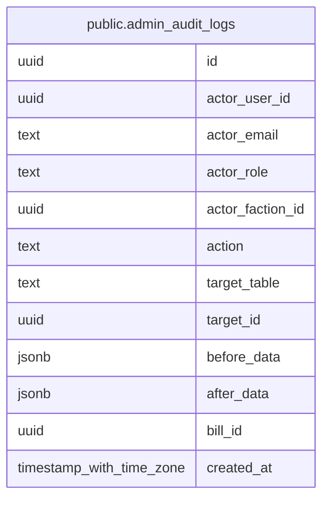

# public.admin_audit_logs

## Description

管理画面からの変更履歴（議案・議案コンテンツ・会派見解）

## Columns

| Name | Type | Default | Nullable | Extra Definition | Children | Parents | Comment |
| ---- | ---- | ------- | -------- | ---------------- | -------- | ------- | ------- |
| id | uuid | gen_random_uuid() | false |  |  |  |  |
| actor_user_id | uuid |  | true |  |  |  | 実行者のユーザーID（null は SQL・スクリプトによる直接操作） |
| actor_email | text |  | true |  |  |  | 実行時点の実行者メールアドレス |
| actor_role | text |  | true |  |  |  | 実行時点の実行者ロール |
| actor_faction_id | uuid |  | true |  |  |  | 実行時点の実行者の所属会派ID |
| action | text |  | false |  |  |  | 操作（例: bills.update, faction_stances.delete） |
| target_table | text |  | false |  |  |  | 対象テーブル |
| target_id | uuid |  | true |  |  |  | 対象行のID |
| before_data | jsonb |  | true |  |  |  | 変更前の行（作成時は null） |
| after_data | jsonb |  | true |  |  |  | 変更後の行（削除時は null） |
| bill_id | uuid |  | true | GENERATED ALWAYS AS  CASE     WHEN (target_table = 'bills'::text) THEN target_id     ELSE (COALESCE((after_data -\>\> 'bill_id'::text), (before_data -\>\> 'bill_id'::text)))::uuid END STORED |  |  | 関連する議案ID（生成列。議案単位の絞り込み用） |
| created_at | timestamp with time zone | now() | false |  |  |  |  |

## Constraints

| Name | Type | Definition |
| ---- | ---- | ---------- |
| admin_audit_logs_actor_consistent | CHECK | CHECK ((((actor_user_id IS NULL) AND (actor_email IS NULL) AND (actor_role IS NULL)) OR ((actor_user_id IS NOT NULL) AND (actor_email IS NOT NULL) AND (actor_role IS NOT NULL)))) |
| admin_audit_logs_pkey | PRIMARY KEY | PRIMARY KEY (id) |

## Indexes

| Name | Definition |
| ---- | ---------- |
| admin_audit_logs_pkey | CREATE UNIQUE INDEX admin_audit_logs_pkey ON public.admin_audit_logs USING btree (id) |
| admin_audit_logs_created_at_idx | CREATE INDEX admin_audit_logs_created_at_idx ON public.admin_audit_logs USING btree (created_at DESC) |
| admin_audit_logs_target_idx | CREATE INDEX admin_audit_logs_target_idx ON public.admin_audit_logs USING btree (target_table, target_id) |
| admin_audit_logs_actor_idx | CREATE INDEX admin_audit_logs_actor_idx ON public.admin_audit_logs USING btree (actor_user_id) |
| admin_audit_logs_bill_id_idx | CREATE INDEX admin_audit_logs_bill_id_idx ON public.admin_audit_logs USING btree (bill_id, created_at DESC) |

## Relations

---

> Generated by [tbls](https://github.com/k1LoW/tbls)
