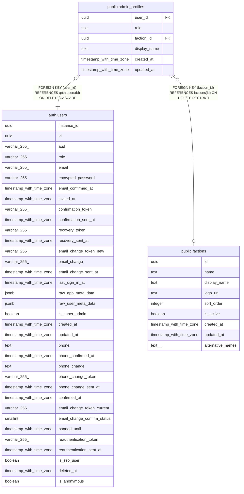

# public.admin_profiles

## Description

管理画面利用者のロールと所属会派

## Columns

| Name | Type | Default | Nullable | Children | Parents | Comment |
| ---- | ---- | ------- | -------- | -------- | ------- | ------- |
| user_id | uuid |  | false |  | [auth.users](auth.users.md) |  |
| role | text |  | false |  |  | ロール(admin:運営者 / legislator:議員 / candidate:出馬者) |
| faction_id | uuid |  | true |  | [public.factions](public.factions.md) | 所属会派ID(legislatorのみ必須) |
| display_name | text |  | false |  |  | 表示名(監査ログや画面表示に使用) |
| created_at | timestamp with time zone | now() | false |  |  |  |
| updated_at | timestamp with time zone | now() | false |  |  |  |

## Constraints

| Name | Type | Definition |
| ---- | ---- | ---------- |
| admin_profiles_faction_required | CHECK | CHECK ((((role = 'legislator'::text) AND (faction_id IS NOT NULL)) OR ((role <> 'legislator'::text) AND (faction_id IS NULL)))) |
| admin_profiles_role_check | CHECK | CHECK ((role = ANY (ARRAY['admin'::text, 'legislator'::text, 'candidate'::text]))) |
| admin_profiles_user_id_fkey | FOREIGN KEY | FOREIGN KEY (user_id) REFERENCES auth.users(id) ON DELETE CASCADE |
| admin_profiles_faction_id_fkey | FOREIGN KEY | FOREIGN KEY (faction_id) REFERENCES factions(id) ON DELETE RESTRICT |
| admin_profiles_pkey | PRIMARY KEY | PRIMARY KEY (user_id) |

## Indexes

| Name | Definition |
| ---- | ---------- |
| admin_profiles_pkey | CREATE UNIQUE INDEX admin_profiles_pkey ON public.admin_profiles USING btree (user_id) |
| admin_profiles_role_idx | CREATE INDEX admin_profiles_role_idx ON public.admin_profiles USING btree (role) |
| admin_profiles_faction_id_idx | CREATE INDEX admin_profiles_faction_id_idx ON public.admin_profiles USING btree (faction_id) |

## Relations

---

> Generated by [tbls](https://github.com/k1LoW/tbls)
