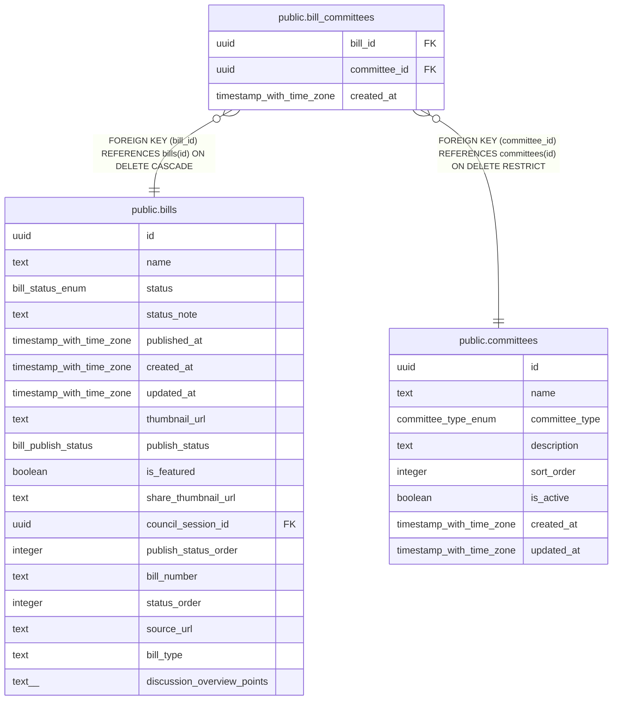

# public.bill_committees

## Description

議案の付託委員会（1議案に複数の委員会を付託できる）

## Columns

| Name | Type | Default | Nullable | Children | Parents | Comment |
| ---- | ---- | ------- | -------- | -------- | ------- | ------- |
| bill_id | uuid |  | false |  | [public.bills](public.bills.md) | 議案ID |
| committee_id | uuid |  | false |  | [public.committees](public.committees.md) | 委員会ID |
| created_at | timestamp with time zone | now() | false |  |  | 作成日時 |

## Constraints

| Name | Type | Definition |
| ---- | ---- | ---------- |
| bill_committees_bill_id_fkey | FOREIGN KEY | FOREIGN KEY (bill_id) REFERENCES bills(id) ON DELETE CASCADE |
| bill_committees_committee_id_fkey | FOREIGN KEY | FOREIGN KEY (committee_id) REFERENCES committees(id) ON DELETE RESTRICT |
| bill_committees_pkey | PRIMARY KEY | PRIMARY KEY (bill_id, committee_id) |

## Indexes

| Name | Definition |
| ---- | ---------- |
| bill_committees_pkey | CREATE UNIQUE INDEX bill_committees_pkey ON public.bill_committees USING btree (bill_id, committee_id) |
| bill_committees_committee_id_idx | CREATE INDEX bill_committees_committee_id_idx ON public.bill_committees USING btree (committee_id) |

## Relations

---

> Generated by [tbls](https://github.com/k1LoW/tbls)
