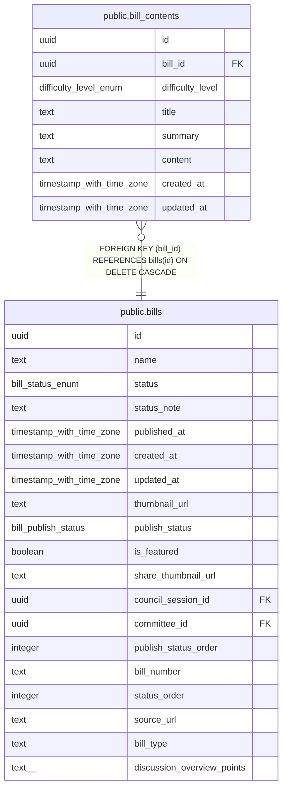

# public.bill_contents

## Description

議案の難易度別コンテンツを管理するテーブル

## Columns

| Name | Type | Default | Nullable | Children | Parents | Comment |
| ---- | ---- | ------- | -------- | -------- | ------- | ------- |
| id | uuid | uuid_generate_v4() | false |  |  | ID |
| bill_id | uuid |  | false |  | [public.bills](public.bills.md) | 議案ID |
| difficulty_level | difficulty_level_enum |  | false |  |  | 難易度レベル（normal:ふつう, hard:難しい） |
| title | text |  | false |  |  | タイトル |
| summary | text |  | false |  |  | 要約 |
| content | text |  | false |  |  | Markdown形式の議案内容 |
| created_at | timestamp with time zone | now() | false |  |  | 作成日時 |
| updated_at | timestamp with time zone | now() | false |  |  | 更新日時 |

## Constraints

| Name | Type | Definition |
| ---- | ---- | ---------- |
| bill_contents_bill_id_difficulty_level_key | UNIQUE | UNIQUE (bill_id, difficulty_level) |
| bill_contents_pkey | PRIMARY KEY | PRIMARY KEY (id) |
| bill_contents_bill_id_fkey | FOREIGN KEY | FOREIGN KEY (bill_id) REFERENCES bills(id) ON DELETE CASCADE |

## Indexes

| Name | Definition |
| ---- | ---------- |
| bill_contents_bill_id_difficulty_level_key | CREATE UNIQUE INDEX bill_contents_bill_id_difficulty_level_key ON public.bill_contents USING btree (bill_id, difficulty_level) |
| bill_contents_pkey | CREATE UNIQUE INDEX bill_contents_pkey ON public.bill_contents USING btree (id) |
| idx_bill_contents_bill_id | CREATE INDEX idx_bill_contents_bill_id ON public.bill_contents USING btree (bill_id) |
| idx_bill_contents_difficulty | CREATE INDEX idx_bill_contents_difficulty ON public.bill_contents USING btree (difficulty_level) |

## Triggers

| Name | Definition |
| ---- | ---------- |
| update_bill_contents_updated_at | CREATE TRIGGER update_bill_contents_updated_at BEFORE UPDATE ON public.bill_contents FOR EACH ROW EXECUTE FUNCTION update_updated_at_column() |
| bill_contents_audit_log | CREATE TRIGGER bill_contents_audit_log AFTER INSERT OR DELETE OR UPDATE ON public.bill_contents FOR EACH ROW EXECUTE FUNCTION record_admin_audit_log() |

## Relations

---

> Generated by [tbls](https://github.com/k1LoW/tbls)
