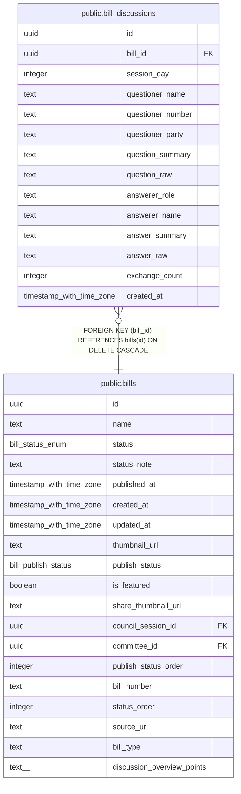

# public.bill_discussions

## Description

議案討論記録

## Columns

| Name | Type | Default | Nullable | Children | Parents | Comment |
| ---- | ---- | ------- | -------- | -------- | ------- | ------- |
| id | uuid | gen_random_uuid() | false |  |  |  |
| bill_id | uuid |  | false |  | [public.bills](public.bills.md) | 議案ID |
| session_day | integer |  | false |  |  | 開催日番号 |
| questioner_name | text |  | false |  |  | 質問者氏名 |
| questioner_number | text |  | true |  |  | 質問者番号 |
| questioner_party | text |  | true |  |  | 質問者会派 |
| question_summary | text |  | true |  |  | 質問要約 |
| question_raw | text |  | true |  |  | 質問原文 |
| answerer_role | text |  | true |  |  | 回答者役職 |
| answerer_name | text |  | true |  |  | 回答者氏名 |
| answer_summary | text |  | true |  |  | 回答要約 |
| answer_raw | text |  | true |  |  | 回答原文 |
| exchange_count | integer | 1 | false |  |  | 質疑回数 |
| created_at | timestamp with time zone | now() | false |  |  |  |

## Constraints

| Name | Type | Definition |
| ---- | ---- | ---------- |
| bill_discussions_bill_id_questioner_name_key | UNIQUE | UNIQUE (bill_id, questioner_name) |
| bill_discussions_pkey | PRIMARY KEY | PRIMARY KEY (id) |
| bill_discussions_bill_id_fkey | FOREIGN KEY | FOREIGN KEY (bill_id) REFERENCES bills(id) ON DELETE CASCADE |

## Indexes

| Name | Definition |
| ---- | ---------- |
| bill_discussions_bill_id_questioner_name_key | CREATE UNIQUE INDEX bill_discussions_bill_id_questioner_name_key ON public.bill_discussions USING btree (bill_id, questioner_name) |
| bill_discussions_pkey | CREATE UNIQUE INDEX bill_discussions_pkey ON public.bill_discussions USING btree (id) |
| bill_discussions_bill_id_idx | CREATE INDEX bill_discussions_bill_id_idx ON public.bill_discussions USING btree (bill_id) |

## Relations

---

> Generated by [tbls](https://github.com/k1LoW/tbls)
