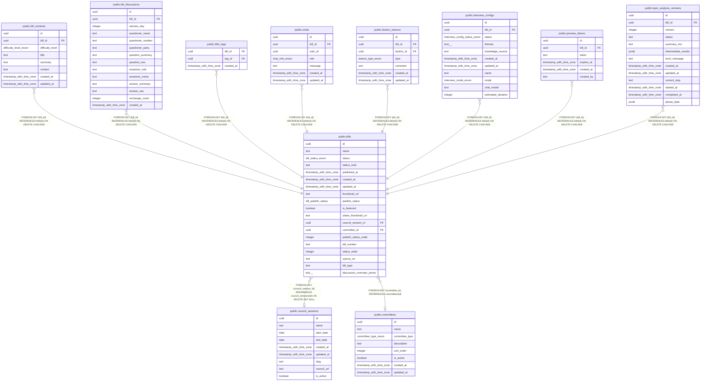

# public.bills

## Description

議案の基本情報を格納するテーブル。コンテンツはbill_contentsテーブルで管理。

## Columns

| Name | Type | Default | Nullable | Extra Definition | Children | Parents | Comment |
| ---- | ---- | ------- | -------- | ---------------- | -------- | ------- | ------- |
| id | uuid | uuid_generate_v4() | false |  | [public.bill_contents](public.bill_contents.md) [public.bill_discussions](public.bill_discussions.md) [public.bills_tags](public.bills_tags.md) [public.chats](public.chats.md) [public.faction_stances](public.faction_stances.md) [public.interview_configs](public.interview_configs.md) [public.preview_tokens](public.preview_tokens.md) [public.topic_analysis_versions](public.topic_analysis_versions.md) |  | ID |
| name | text |  | false |  |  |  | 議案名 |
| status | bill_status_enum |  | false |  |  |  | 議案のステータス |
| status_note | text |  | true |  |  |  | ステータス備考 |
| published_at | timestamp with time zone |  | true |  |  |  | サービスでの議案公開日時 |
| created_at | timestamp with time zone | now() | false |  |  |  | 作成日時 |
| updated_at | timestamp with time zone | now() | false |  |  |  | 更新日時 |
| thumbnail_url | text |  | true |  |  |  | URL to the bill thumbnail image stored in Supabase Storage |
| publish_status | bill_publish_status | 'draft'::bill_publish_status | false |  |  |  | Publication status: draft (private) or published (public) |
| is_featured | boolean | false | false |  |  |  | Flag to indicate if this bill is featured on the homepage |
| share_thumbnail_url | text |  | true |  |  |  | シェア用OGP画像URL |
| council_session_id | uuid |  | true |  |  | [public.council_sessions](public.council_sessions.md) | 紐付けられた会期ID |
| committee_id | uuid |  | true |  |  | [public.committees](public.committees.md) | 委員会ID |
| publish_status_order | integer |  | true | GENERATED ALWAYS AS  CASE publish_status     WHEN 'draft'::bill_publish_status THEN 0     WHEN 'coming_soon'::bill_publish_status THEN 1     WHEN 'published'::bill_publish_status THEN 2     ELSE NULL::integer END STORED |  |  | 公開状態ソート順(draft → coming_soon → published の順。Generated Column) |
| bill_number | text | ''::text | false |  |  |  | 議案番号（例: 「第1号」「報告第1号」など）。空文字は未設定を示す。 |
| status_order | integer |  | true | GENERATED ALWAYS AS  CASE status     WHEN 'approved'::bill_status_enum THEN 0     WHEN 'adopted'::bill_status_enum THEN 0     WHEN 'reported'::bill_status_enum THEN 0     WHEN 'partially_adopted'::bill_status_enum THEN 1     WHEN 'rejected'::bill_status_enum THEN 2     WHEN 'plenary_session'::bill_status_enum THEN 3     WHEN 'in_committee'::bill_status_enum THEN 4     WHEN 'submitted'::bill_status_enum THEN 5     WHEN 'preparing'::bill_status_enum THEN 6     ELSE NULL::integer END STORED |  |  |  |
| source_url | text |  | true |  |  |  | 出典URL（議案のPDF等） |
| bill_type | text | 'bill'::text | false |  |  |  | 議案種別(bill:通常議案 / bill_settlement:決算認定 / bill_personnel:人事同意 / bill_ratification:専決処分承認 / consultation:諮問 / opinion:意見書案 / petition:請願 / appeal:陳情 / report:報告 / resolution:決議 / member_bill:議員提出議案) |
| discussion_overview_points | text[] | '{}'::text[] | false |  |  |  | 議論概要ポイント |

## Constraints

| Name | Type | Definition |
| ---- | ---- | ---------- |
| bills_bill_type_check | CHECK | CHECK ((bill_type = ANY (ARRAY['bill'::text, 'bill_settlement'::text, 'bill_personnel'::text, 'bill_ratification'::text, 'consultation'::text, 'opinion'::text, 'petition'::text, 'appeal'::text, 'report'::text, 'resolution'::text, 'member_bill'::text]))) |
| bills_pkey | PRIMARY KEY | PRIMARY KEY (id) |
| bills_committee_id_fkey | FOREIGN KEY | FOREIGN KEY (committee_id) REFERENCES committees(id) |
| bills_council_session_id_fkey | FOREIGN KEY | FOREIGN KEY (council_session_id) REFERENCES council_sessions(id) ON DELETE SET NULL |

## Indexes

| Name | Definition |
| ---- | ---------- |
| bills_pkey | CREATE UNIQUE INDEX bills_pkey ON public.bills USING btree (id) |
| bills_session_number_type_unique | CREATE UNIQUE INDEX bills_session_number_type_unique ON public.bills USING btree (council_session_id, bill_number, bill_type) WHERE (bill_number <> ''::text) |
| idx_bills_committee_id | CREATE INDEX idx_bills_committee_id ON public.bills USING btree (committee_id) |
| idx_bills_council_session_id | CREATE INDEX idx_bills_council_session_id ON public.bills USING btree (council_session_id) |
| idx_bills_is_featured | CREATE INDEX idx_bills_is_featured ON public.bills USING btree (is_featured) WHERE (is_featured = true) |
| idx_bills_publish_status | CREATE INDEX idx_bills_publish_status ON public.bills USING btree (publish_status) |
| idx_bills_publish_status_order | CREATE INDEX idx_bills_publish_status_order ON public.bills USING btree (publish_status_order) |
| idx_bills_published_at | CREATE INDEX idx_bills_published_at ON public.bills USING btree (published_at DESC) |
| idx_bills_status | CREATE INDEX idx_bills_status ON public.bills USING btree (status) |
| idx_bills_status_order | CREATE INDEX idx_bills_status_order ON public.bills USING btree (status_order) |

## Triggers

| Name | Definition |
| ---- | ---------- |
| update_bills_updated_at | CREATE TRIGGER update_bills_updated_at BEFORE UPDATE ON public.bills FOR EACH ROW EXECUTE FUNCTION update_updated_at_column() |
| bills_audit_log | CREATE TRIGGER bills_audit_log AFTER INSERT OR DELETE OR UPDATE ON public.bills FOR EACH ROW EXECUTE FUNCTION record_admin_audit_log() |

## Relations

---

> Generated by [tbls](https://github.com/k1LoW/tbls)
