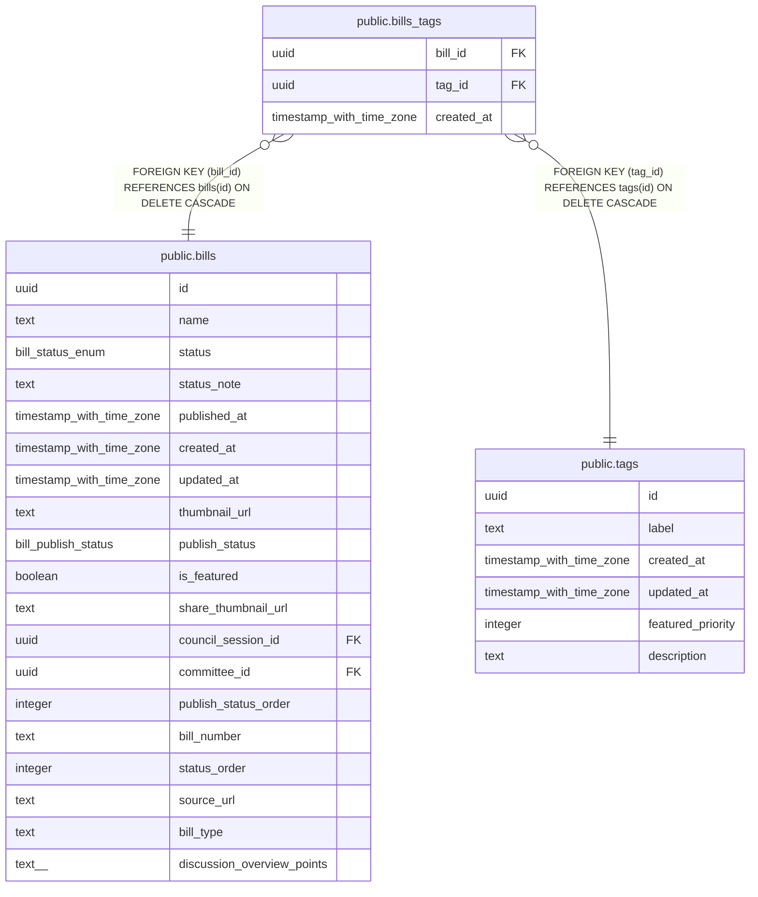

# public.bills_tags

## Description

Junction table for bills and tags relationship

## Columns

| Name | Type | Default | Nullable | Children | Parents | Comment |
| ---- | ---- | ------- | -------- | -------- | ------- | ------- |
| bill_id | uuid |  | false |  | [public.bills](public.bills.md) | Bill ID |
| tag_id | uuid |  | false |  | [public.tags](public.tags.md) | Tag ID |
| created_at | timestamp with time zone | now() | false |  |  | 作成日時 |

## Constraints

| Name | Type | Definition |
| ---- | ---- | ---------- |
| bills_tags_bill_id_fkey | FOREIGN KEY | FOREIGN KEY (bill_id) REFERENCES bills(id) ON DELETE CASCADE |
| bills_tags_pkey | PRIMARY KEY | PRIMARY KEY (bill_id, tag_id) |
| bills_tags_tag_id_fkey | FOREIGN KEY | FOREIGN KEY (tag_id) REFERENCES tags(id) ON DELETE CASCADE |

## Indexes

| Name | Definition |
| ---- | ---------- |
| bills_tags_pkey | CREATE UNIQUE INDEX bills_tags_pkey ON public.bills_tags USING btree (bill_id, tag_id) |

## Relations

---

> Generated by [tbls](https://github.com/k1LoW/tbls)
