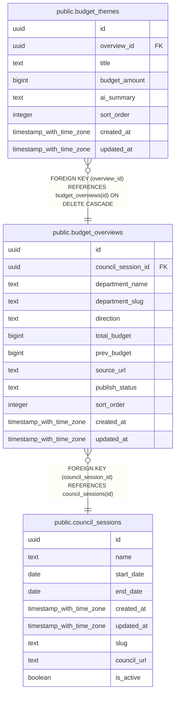

# public.budget_overviews

## Description

予算概要(部局ごと×定例会ごと)

## Columns

| Name | Type | Default | Nullable | Children | Parents | Comment |
| ---- | ---- | ------- | -------- | -------- | ------- | ------- |
| id | uuid | gen_random_uuid() | false | [public.budget_themes](public.budget_themes.md) |  |  |
| council_session_id | uuid |  | false |  | [public.council_sessions](public.council_sessions.md) | 市議会定例会ID |
| department_name | text |  | false |  |  | 部局名 |
| department_slug | text |  | false |  |  | 部局スラッグ |
| direction | text |  | true |  |  | 方針 |
| total_budget | bigint |  | true |  |  | 当年度予算総額 |
| prev_budget | bigint |  | true |  |  | 前年度予算総額 |
| source_url | text |  | true |  |  | 出典URL |
| publish_status | text | 'draft'::text | false |  |  | 公開状態(draft/published) |
| sort_order | integer | 0 | false |  |  | 表示順 |
| created_at | timestamp with time zone | now() | false |  |  |  |
| updated_at | timestamp with time zone | now() | false |  |  |  |

## Constraints

| Name | Type | Definition |
| ---- | ---- | ---------- |
| budget_overviews_publish_status_check | CHECK | CHECK ((publish_status = ANY (ARRAY['draft'::text, 'published'::text]))) |
| budget_overviews_council_session_id_department_slug_key | UNIQUE | UNIQUE (council_session_id, department_slug) |
| budget_overviews_pkey | PRIMARY KEY | PRIMARY KEY (id) |
| budget_overviews_council_session_id_fkey | FOREIGN KEY | FOREIGN KEY (council_session_id) REFERENCES council_sessions(id) |

## Indexes

| Name | Definition |
| ---- | ---------- |
| budget_overviews_council_session_id_department_slug_key | CREATE UNIQUE INDEX budget_overviews_council_session_id_department_slug_key ON public.budget_overviews USING btree (council_session_id, department_slug) |
| budget_overviews_pkey | CREATE UNIQUE INDEX budget_overviews_pkey ON public.budget_overviews USING btree (id) |

## Relations

---

> Generated by [tbls](https://github.com/k1LoW/tbls)
