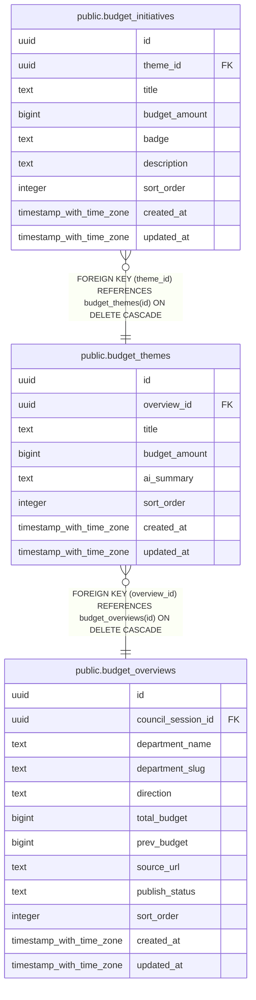

# public.budget_themes

## Description

予算テーマ(部局ごとの主要テーマ)

## Columns

| Name | Type | Default | Nullable | Children | Parents | Comment |
| ---- | ---- | ------- | -------- | -------- | ------- | ------- |
| id | uuid | gen_random_uuid() | false | [public.budget_initiatives](public.budget_initiatives.md) |  |  |
| overview_id | uuid |  | false |  | [public.budget_overviews](public.budget_overviews.md) | 予算概要ID |
| title | text |  | false |  |  | テーマタイトル |
| budget_amount | bigint |  | true |  |  | 予算額 |
| ai_summary | text |  | true |  |  | AI要約 |
| sort_order | integer | 0 | false |  |  | 表示順 |
| created_at | timestamp with time zone | now() | false |  |  |  |
| updated_at | timestamp with time zone | now() | false |  |  |  |

## Constraints

| Name | Type | Definition |
| ---- | ---- | ---------- |
| budget_themes_overview_id_fkey | FOREIGN KEY | FOREIGN KEY (overview_id) REFERENCES budget_overviews(id) ON DELETE CASCADE |
| budget_themes_pkey | PRIMARY KEY | PRIMARY KEY (id) |

## Indexes

| Name | Definition |
| ---- | ---------- |
| budget_themes_pkey | CREATE UNIQUE INDEX budget_themes_pkey ON public.budget_themes USING btree (id) |

## Relations

---

> Generated by [tbls](https://github.com/k1LoW/tbls)
