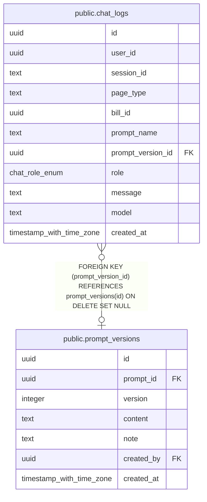

# public.chat_logs

## Description

AIチャットの会話ログ（保存期間90日。delete_expired_chat_logs で削除する）

## Columns

| Name | Type | Default | Nullable | Children | Parents | Comment |
| ---- | ---- | ------- | -------- | -------- | ------- | ------- |
| id | uuid | gen_random_uuid() | false |  |  |  |
| user_id | uuid |  | false |  |  | ユーザーID（Supabase匿名認証） |
| session_id | text |  | true |  |  | チャットのセッションID（ブラウザが発行） |
| page_type | text |  | false |  |  | チャットを開いたページ(home / bill / budget) |
| bill_id | uuid |  | true |  |  | 議案ID（議案ページのみ） |
| prompt_name | text |  | false |  |  | 使ったシステムプロンプトの名前 |
| prompt_version_id | uuid |  | true |  | [public.prompt_versions](public.prompt_versions.md) | 使ったプロンプトの版（DB管理外のプロンプトは NULL） |
| role | chat_role_enum |  | false |  |  | 発言者(user / assistant) |
| message | text |  | false |  |  | 発言の本文 |
| model | text |  | true |  |  | 応答したモデル（assistant のみ） |
| created_at | timestamp with time zone | now() | false |  |  |  |

## Constraints

| Name | Type | Definition |
| ---- | ---- | ---------- |
| chat_logs_page_type_check | CHECK | CHECK ((page_type = ANY (ARRAY['home'::text, 'bill'::text, 'budget'::text]))) |
| chat_logs_prompt_version_id_fkey | FOREIGN KEY | FOREIGN KEY (prompt_version_id) REFERENCES prompt_versions(id) ON DELETE SET NULL |
| chat_logs_pkey | PRIMARY KEY | PRIMARY KEY (id) |

## Indexes

| Name | Definition |
| ---- | ---------- |
| chat_logs_pkey | CREATE UNIQUE INDEX chat_logs_pkey ON public.chat_logs USING btree (id) |
| chat_logs_created_at_idx | CREATE INDEX chat_logs_created_at_idx ON public.chat_logs USING btree (created_at) |
| chat_logs_session_id_idx | CREATE INDEX chat_logs_session_id_idx ON public.chat_logs USING btree (session_id) |
| chat_logs_bill_id_idx | CREATE INDEX chat_logs_bill_id_idx ON public.chat_logs USING btree (bill_id) |

## Relations

---

> Generated by [tbls](https://github.com/k1LoW/tbls)
