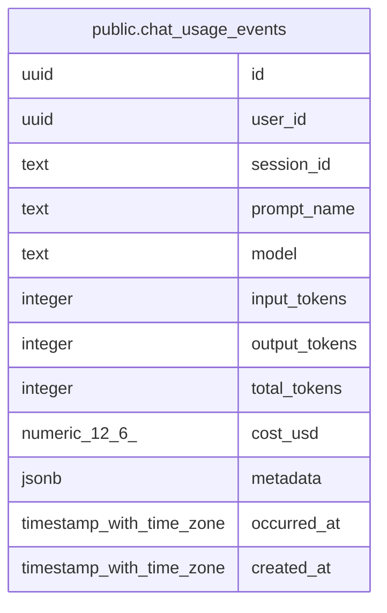

# public.chat_usage_events

## Description

チャットAI利用ログ

## Columns

| Name | Type | Default | Nullable | Children | Parents | Comment |
| ---- | ---- | ------- | -------- | -------- | ------- | ------- |
| id | uuid | gen_random_uuid() | false |  |  |  |
| user_id | uuid |  | false |  |  | ユーザーID |
| session_id | text |  | true |  |  | セッションID |
| prompt_name | text |  | true |  |  | プロンプト名 |
| model | text |  | false |  |  | モデルID |
| input_tokens | integer | 0 | false |  |  | 入力トークン数 |
| output_tokens | integer | 0 | false |  |  | 出力トークン数 |
| total_tokens | integer | 0 | false |  |  | 合計トークン数 |
| cost_usd | numeric(12,6) | 0 | false |  |  | コスト(USD) |
| metadata | jsonb |  | true |  |  | メタデータ |
| occurred_at | timestamp with time zone | now() | false |  |  | 発生日時 |
| created_at | timestamp with time zone | now() | false |  |  | 作成日時 |

## Constraints

| Name | Type | Definition |
| ---- | ---- | ---------- |
| chat_usage_events_pkey | PRIMARY KEY | PRIMARY KEY (id) |

## Indexes

| Name | Definition |
| ---- | ---------- |
| chat_usage_events_pkey | CREATE UNIQUE INDEX chat_usage_events_pkey ON public.chat_usage_events USING btree (id) |
| chat_usage_events_user_id_occurred_at_idx | CREATE INDEX chat_usage_events_user_id_occurred_at_idx ON public.chat_usage_events USING btree (user_id, occurred_at) |
| chat_usage_events_occurred_at_idx | CREATE INDEX chat_usage_events_occurred_at_idx ON public.chat_usage_events USING btree (occurred_at) |

## Relations

---

> Generated by [tbls](https://github.com/k1LoW/tbls)
