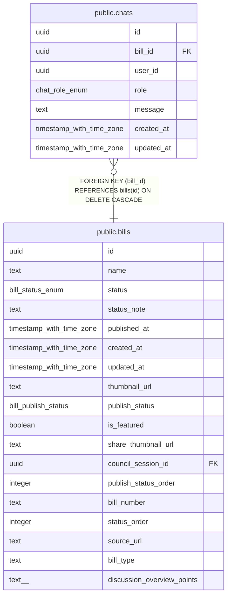

# public.chats

## Description

AIとの対話履歴を管理するテーブル

## Columns

| Name | Type | Default | Nullable | Children | Parents | Comment |
| ---- | ---- | ------- | -------- | -------- | ------- | ------- |
| id | uuid | uuid_generate_v4() | false |  |  | ID |
| bill_id | uuid |  | false |  | [public.bills](public.bills.md) | 議案ID |
| user_id | uuid |  | true |  |  | ユーザーID（Supabase匿名認証） |
| role | chat_role_enum |  | false |  |  | メッセージの送信者役割 |
| message | text |  | false |  |  | メッセージ本文 |
| created_at | timestamp with time zone | now() | false |  |  | 作成日時 |
| updated_at | timestamp with time zone | now() | false |  |  | 更新日時 |

## Constraints

| Name | Type | Definition |
| ---- | ---- | ---------- |
| chats_bill_id_fkey | FOREIGN KEY | FOREIGN KEY (bill_id) REFERENCES bills(id) ON DELETE CASCADE |
| chats_pkey | PRIMARY KEY | PRIMARY KEY (id) |

## Indexes

| Name | Definition |
| ---- | ---------- |
| chats_pkey | CREATE UNIQUE INDEX chats_pkey ON public.chats USING btree (id) |
| idx_chats_bill_id | CREATE INDEX idx_chats_bill_id ON public.chats USING btree (bill_id) |
| idx_chats_bill_user | CREATE INDEX idx_chats_bill_user ON public.chats USING btree (bill_id, user_id) |
| idx_chats_created_at | CREATE INDEX idx_chats_created_at ON public.chats USING btree (created_at DESC) |
| idx_chats_user_id | CREATE INDEX idx_chats_user_id ON public.chats USING btree (user_id) |

## Triggers

| Name | Definition |
| ---- | ---------- |
| update_chats_updated_at | CREATE TRIGGER update_chats_updated_at BEFORE UPDATE ON public.chats FOR EACH ROW EXECUTE FUNCTION update_updated_at_column() |

## Relations

---

> Generated by [tbls](https://github.com/k1LoW/tbls)
