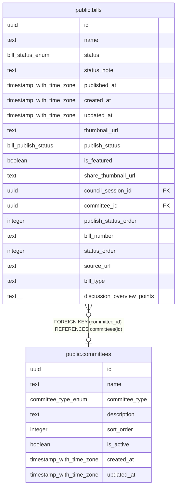

# public.committees

## Description

委員会マスター

## Columns

| Name | Type | Default | Nullable | Children | Parents | Comment |
| ---- | ---- | ------- | -------- | -------- | ------- | ------- |
| id | uuid | gen_random_uuid() | false | [public.bills](public.bills.md) |  |  |
| name | text |  | false |  |  | 委員会名 |
| committee_type | committee_type_enum | 'standing'::committee_type_enum | false |  |  | 委員会種別（standing: 常任, parliamentary: 議会運営, special: 調査特別） |
| description | text |  | true |  |  | 委員会説明 |
| sort_order | integer | 0 | false |  |  | 表示順 |
| is_active | boolean | true | false |  |  | 有効フラグ |
| created_at | timestamp with time zone | now() | false |  |  |  |
| updated_at | timestamp with time zone | now() | false |  |  |  |

## Constraints

| Name | Type | Definition |
| ---- | ---- | ---------- |
| committees_pkey | PRIMARY KEY | PRIMARY KEY (id) |

## Indexes

| Name | Definition |
| ---- | ---------- |
| committees_pkey | CREATE UNIQUE INDEX committees_pkey ON public.committees USING btree (id) |

## Triggers

| Name | Definition |
| ---- | ---------- |
| set_committees_updated_at | CREATE TRIGGER set_committees_updated_at BEFORE UPDATE ON public.committees FOR EACH ROW EXECUTE FUNCTION update_updated_at_column() |

## Relations

---

> Generated by [tbls](https://github.com/k1LoW/tbls)
