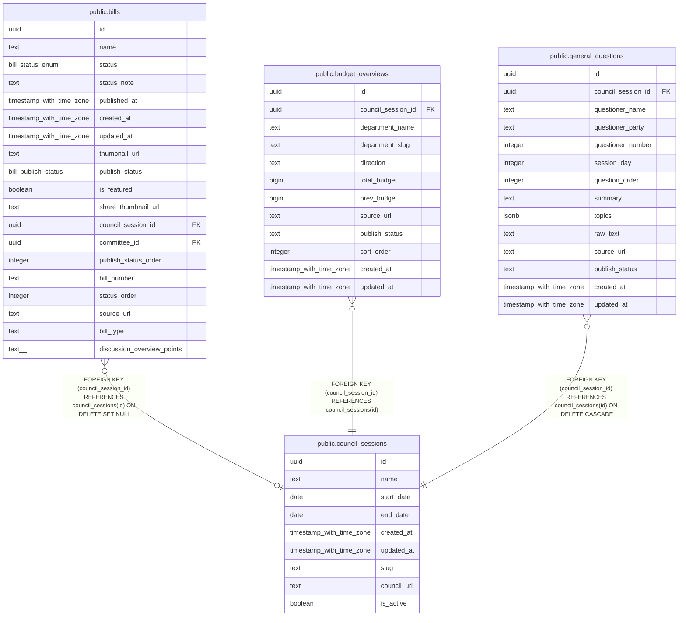

# public.council_sessions

## Description

国会会期マスタテーブル

## Columns

| Name | Type | Default | Nullable | Children | Parents | Comment |
| ---- | ---- | ------- | -------- | -------- | ------- | ------- |
| id | uuid | gen_random_uuid() | false | [public.bills](public.bills.md) [public.budget_overviews](public.budget_overviews.md) [public.general_questions](public.general_questions.md) |  | ID |
| name | text |  | false |  |  | 会期名 |
| start_date | date |  | false |  |  | 開始日 |
| end_date | date |  | true |  |  | 終了日 |
| created_at | timestamp with time zone | now() | false |  |  | 作成日時 |
| updated_at | timestamp with time zone | now() | false |  |  | 更新日時 |
| slug | text |  | true |  |  | URL用のスラッグ（例: 219-rinji, 218-jokai） |
| council_url | text |  | true |  |  | 衆議院の国会議案情報ページURL |
| is_active | boolean | false | false |  |  | Whether this session is the active one displayed on the top page. Only one session can be active at a time. |

## Constraints

| Name | Type | Definition |
| ---- | ---- | ---------- |
| end_date_after_start_date | CHECK | CHECK ((end_date >= start_date)) |
| diet_sessions_pkey | PRIMARY KEY | PRIMARY KEY (id) |
| diet_sessions_slug_key | UNIQUE | UNIQUE (slug) |

## Indexes

| Name | Definition |
| ---- | ---------- |
| diet_sessions_pkey | CREATE UNIQUE INDEX diet_sessions_pkey ON public.council_sessions USING btree (id) |
| diet_sessions_slug_key | CREATE UNIQUE INDEX diet_sessions_slug_key ON public.council_sessions USING btree (slug) |
| idx_council_sessions_date_range | CREATE INDEX idx_council_sessions_date_range ON public.council_sessions USING btree (start_date, end_date) |
| idx_diet_sessions_slug | CREATE INDEX idx_diet_sessions_slug ON public.council_sessions USING btree (slug) |

## Triggers

| Name | Definition |
| ---- | ---------- |
| set_updated_at | CREATE TRIGGER set_updated_at BEFORE UPDATE ON public.council_sessions FOR EACH ROW EXECUTE FUNCTION update_updated_at_column() |

## Relations

---

> Generated by [tbls](https://github.com/k1LoW/tbls)
