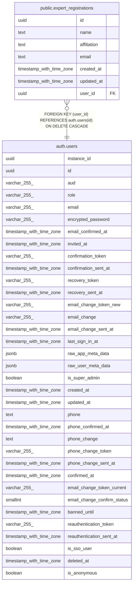

# public.expert_registrations

## Description

有識者リスト登録情報を管理するテーブル

## Columns

| Name | Type | Default | Nullable | Children | Parents | Comment |
| ---- | ---- | ------- | -------- | -------- | ------- | ------- |
| id | uuid | gen_random_uuid() | false |  |  |  |
| name | text |  | false |  |  | 有識者の氏名 |
| affiliation | text |  | false |  |  | 所属・肩書 |
| email | text |  | false |  |  | メールアドレス |
| created_at | timestamp with time zone | now() | false |  |  |  |
| updated_at | timestamp with time zone | now() | false |  |  |  |
| user_id | uuid |  | false |  | [auth.users](auth.users.md) | 登録したユーザーのID |

## Constraints

| Name | Type | Definition |
| ---- | ---- | ---------- |
| expert_registrations_user_id_fkey | FOREIGN KEY | FOREIGN KEY (user_id) REFERENCES auth.users(id) ON DELETE CASCADE |
| expert_registrations_pkey | PRIMARY KEY | PRIMARY KEY (id) |

## Indexes

| Name | Definition |
| ---- | ---------- |
| expert_registrations_pkey | CREATE UNIQUE INDEX expert_registrations_pkey ON public.expert_registrations USING btree (id) |
| idx_expert_registrations_email | CREATE UNIQUE INDEX idx_expert_registrations_email ON public.expert_registrations USING btree (email) |
| idx_expert_registrations_user_id | CREATE UNIQUE INDEX idx_expert_registrations_user_id ON public.expert_registrations USING btree (user_id) |

## Triggers

| Name | Definition |
| ---- | ---------- |
| update_expert_registrations_updated_at | CREATE TRIGGER update_expert_registrations_updated_at BEFORE UPDATE ON public.expert_registrations FOR EACH ROW EXECUTE FUNCTION update_updated_at_column() |

## Relations

---

> Generated by [tbls](https://github.com/k1LoW/tbls)
