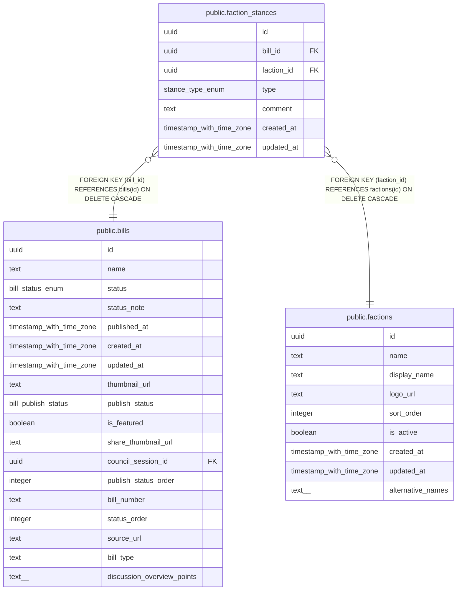

# public.faction_stances

## Description

会派見解（1議案に複数会派の見解を登録可能）

## Columns

| Name | Type | Default | Nullable | Children | Parents | Comment |
| ---- | ---- | ------- | -------- | -------- | ------- | ------- |
| id | uuid | gen_random_uuid() | false |  |  |  |
| bill_id | uuid |  | false |  | [public.bills](public.bills.md) | 議案ID |
| faction_id | uuid |  | false |  | [public.factions](public.factions.md) | 会派ID |
| type | stance_type_enum |  | false |  |  | スタンス種別 |
| comment | text |  | true |  |  | コメント |
| created_at | timestamp with time zone | now() | false |  |  |  |
| updated_at | timestamp with time zone | now() | false |  |  |  |

## Constraints

| Name | Type | Definition |
| ---- | ---- | ---------- |
| faction_stances_bill_id_fkey | FOREIGN KEY | FOREIGN KEY (bill_id) REFERENCES bills(id) ON DELETE CASCADE |
| faction_stances_bill_id_faction_id_key | UNIQUE | UNIQUE (bill_id, faction_id) |
| faction_stances_pkey | PRIMARY KEY | PRIMARY KEY (id) |
| faction_stances_faction_id_fkey | FOREIGN KEY | FOREIGN KEY (faction_id) REFERENCES factions(id) ON DELETE CASCADE |

## Indexes

| Name | Definition |
| ---- | ---------- |
| faction_stances_bill_id_faction_id_key | CREATE UNIQUE INDEX faction_stances_bill_id_faction_id_key ON public.faction_stances USING btree (bill_id, faction_id) |
| faction_stances_pkey | CREATE UNIQUE INDEX faction_stances_pkey ON public.faction_stances USING btree (id) |
| idx_faction_stances_bill_id | CREATE INDEX idx_faction_stances_bill_id ON public.faction_stances USING btree (bill_id) |
| idx_faction_stances_faction_id | CREATE INDEX idx_faction_stances_faction_id ON public.faction_stances USING btree (faction_id) |

## Triggers

| Name | Definition |
| ---- | ---------- |
| set_faction_stances_updated_at | CREATE TRIGGER set_faction_stances_updated_at BEFORE UPDATE ON public.faction_stances FOR EACH ROW EXECUTE FUNCTION update_updated_at_column() |

## Relations

---

> Generated by [tbls](https://github.com/k1LoW/tbls)
