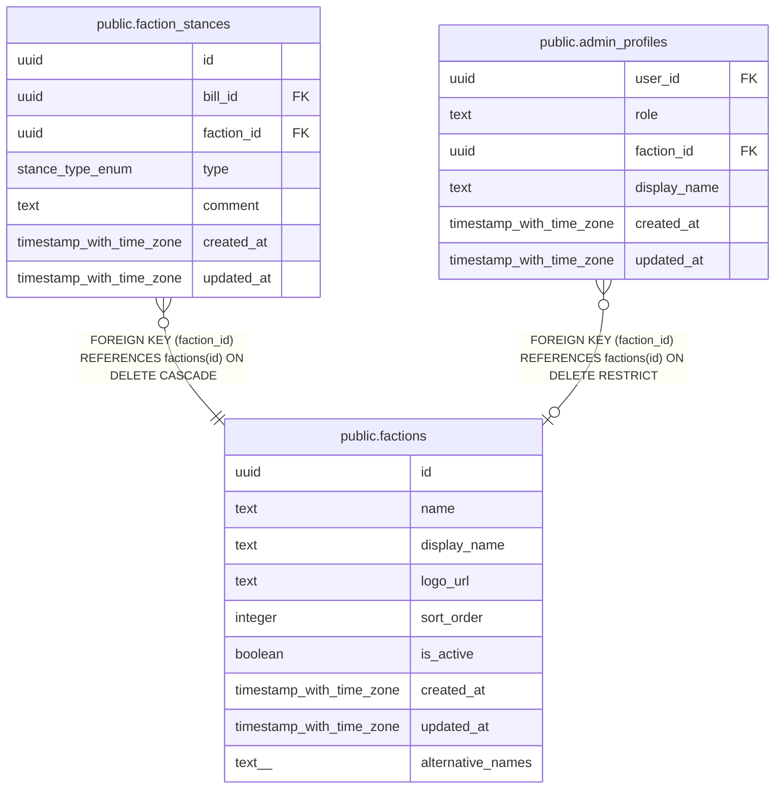

# public.factions

## Description

会派マスター

## Columns

| Name | Type | Default | Nullable | Children | Parents | Comment |
| ---- | ---- | ------- | -------- | -------- | ------- | ------- |
| id | uuid | gen_random_uuid() | false | [public.faction_stances](public.faction_stances.md) [public.admin_profiles](public.admin_profiles.md) |  |  |
| name | text |  | false |  |  | 会派名 |
| display_name | text |  | false |  |  | 会派表示名 |
| logo_url | text |  | true |  |  | ロゴ画像URL |
| sort_order | integer | 0 | false |  |  | 表示順 |
| is_active | boolean | true | false |  |  | 有効フラグ |
| created_at | timestamp with time zone | now() | false |  |  |  |
| updated_at | timestamp with time zone | now() | false |  |  |  |
| alternative_names | text[] | '{}'::text[] | false |  |  | 別名一覧(略称・旧称等) |

## Constraints

| Name | Type | Definition |
| ---- | ---- | ---------- |
| factions_pkey | PRIMARY KEY | PRIMARY KEY (id) |

## Indexes

| Name | Definition |
| ---- | ---------- |
| factions_pkey | CREATE UNIQUE INDEX factions_pkey ON public.factions USING btree (id) |

## Triggers

| Name | Definition |
| ---- | ---------- |
| set_factions_updated_at | CREATE TRIGGER set_factions_updated_at BEFORE UPDATE ON public.factions FOR EACH ROW EXECUTE FUNCTION update_updated_at_column() |

## Relations

---

> Generated by [tbls](https://github.com/k1LoW/tbls)
