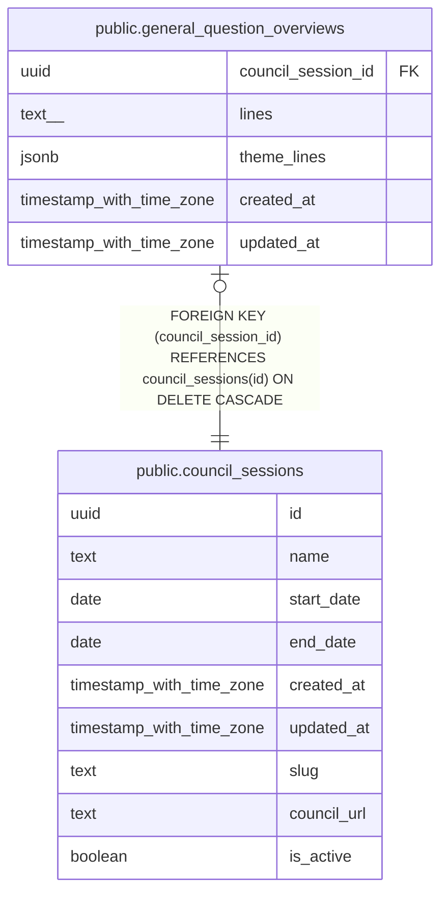

# public.general_question_overviews

## Description

定例会ごとの一般質問（代表質問）の3行まとめ。本文は AI の下書きをユーザーが確認してから登録する

## Columns

| Name | Type | Default | Nullable | Children | Parents | Comment |
| ---- | ---- | ------- | -------- | -------- | ------- | ------- |
| council_session_id | uuid |  | false |  | [public.council_sessions](public.council_sessions.md) |  |
| lines | text[] | '{}'::text[] | false |  |  | 定例会全体の「どんな話があった？」3行。未作成なら空配列 |
| theme_lines | jsonb | '{}'::jsonb | false |  |  | テーマ（カテゴリラベル）ごとの3行。{ "子育て・教育": ["…","…","…"] } の形 |
| created_at | timestamp with time zone | now() | false |  |  |  |
| updated_at | timestamp with time zone | now() | false |  |  |  |

## Constraints

| Name | Type | Definition |
| ---- | ---- | ---------- |
| general_question_overviews_council_session_id_fkey | FOREIGN KEY | FOREIGN KEY (council_session_id) REFERENCES council_sessions(id) ON DELETE CASCADE |
| general_question_overviews_pkey | PRIMARY KEY | PRIMARY KEY (council_session_id) |

## Indexes

| Name | Definition |
| ---- | ---------- |
| general_question_overviews_pkey | CREATE UNIQUE INDEX general_question_overviews_pkey ON public.general_question_overviews USING btree (council_session_id) |

## Relations

---

> Generated by [tbls](https://github.com/k1LoW/tbls)
