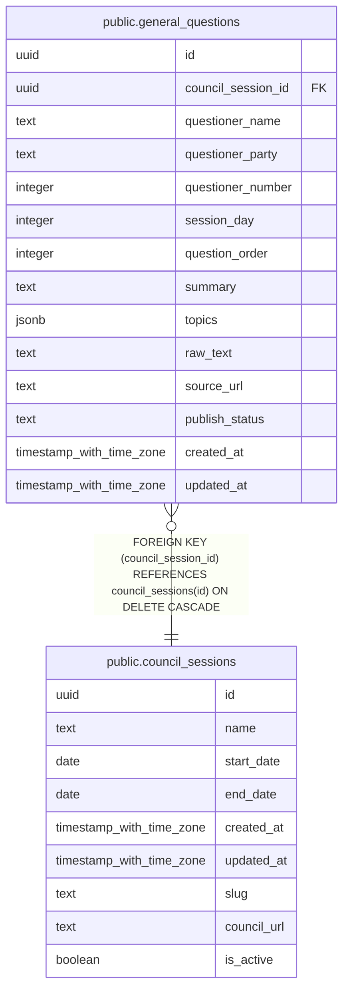

# public.general_questions

## Description

一般質問

## Columns

| Name | Type | Default | Nullable | Children | Parents | Comment |
| ---- | ---- | ------- | -------- | -------- | ------- | ------- |
| id | uuid | gen_random_uuid() | false |  |  |  |
| council_session_id | uuid |  | false |  | [public.council_sessions](public.council_sessions.md) | 市議会定例会ID |
| questioner_name | text |  | false |  |  | 質問者氏名 |
| questioner_party | text |  | true |  |  | 質問者会派 |
| questioner_number | integer |  | true |  |  | 質問者番号 |
| session_day | integer | 1 | false |  |  | 開催日番号 |
| question_order | integer | 1 | false |  |  | 質問順序 |
| summary | text |  | true |  |  | 質問要約 |
| topics | jsonb | '[]'::jsonb | false |  |  | トピック一覧(JSON配列) |
| raw_text | text |  | true |  |  | 原文 |
| source_url | text |  | true |  |  | 出典URL |
| publish_status | text | 'draft'::text | false |  |  | 公開状態(draft/published) |
| created_at | timestamp with time zone | now() | true |  |  |  |
| updated_at | timestamp with time zone | now() | true |  |  |  |

## Constraints

| Name | Type | Definition |
| ---- | ---- | ---------- |
| general_questions_publish_status_check | CHECK | CHECK ((publish_status = ANY (ARRAY['draft'::text, 'published'::text]))) |
| general_questions_council_session_id_fkey | FOREIGN KEY | FOREIGN KEY (council_session_id) REFERENCES council_sessions(id) ON DELETE CASCADE |
| general_questions_pkey | PRIMARY KEY | PRIMARY KEY (id) |

## Indexes

| Name | Definition |
| ---- | ---------- |
| general_questions_pkey | CREATE UNIQUE INDEX general_questions_pkey ON public.general_questions USING btree (id) |
| general_questions_council_session_id_session_day_question_o_idx | CREATE INDEX general_questions_council_session_id_session_day_question_o_idx ON public.general_questions USING btree (council_session_id, session_day, question_order) |
| general_questions_publish_status_idx | CREATE INDEX general_questions_publish_status_idx ON public.general_questions USING btree (publish_status) |

## Triggers

| Name | Definition |
| ---- | ---------- |
| update_general_questions_updated_at | CREATE TRIGGER update_general_questions_updated_at BEFORE UPDATE ON public.general_questions FOR EACH ROW EXECUTE FUNCTION update_updated_at_column() |

## Relations

---

> Generated by [tbls](https://github.com/k1LoW/tbls)
