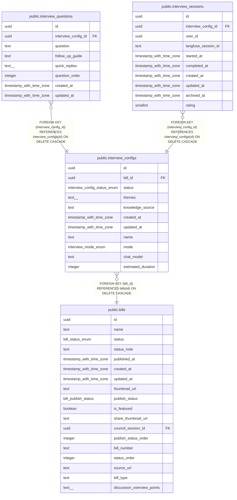

# public.interview_configs

## Description

議案ごとのインタビュー設定を管理するテーブル

## Columns

| Name | Type | Default | Nullable | Children | Parents | Comment |
| ---- | ---- | ------- | -------- | -------- | ------- | ------- |
| id | uuid | gen_random_uuid() | false | [public.interview_questions](public.interview_questions.md) [public.interview_sessions](public.interview_sessions.md) |  |  |
| bill_id | uuid |  | false |  | [public.bills](public.bills.md) | 対象議案ID（複数設定可、ただしpublicは1つのみ） |
| status | interview_config_status_enum | 'closed'::interview_config_status_enum | false |  |  | 設定ステータス（public: 公開/有効, closed: 非公開/無効） |
| themes | text[] |  | true |  |  | テーマの配列 |
| knowledge_source | text |  | true |  |  | 議案のコンテキスト情報 |
| created_at | timestamp with time zone | now() | false |  |  | 作成日時 |
| updated_at | timestamp with time zone | now() | false |  |  | 更新日時 |
| name | text |  | false |  |  | 設定名（識別用） |
| mode | interview_mode_enum | 'loop'::interview_mode_enum | false |  |  | インタビューモード: loop（逐次深掘り）または bulk（一括深掘り） |
| chat_model | text |  | true |  |  | チャット用AIモデルID（Vercel AI Gateway形式 例:"openai/gpt-4o-mini" NULL=デフォルト） |
| estimated_duration | integer |  | true |  |  | 目安所要時間(分・NULLはタイムマネジメントしない) |

## Constraints

| Name | Type | Definition |
| ---- | ---- | ---------- |
| interview_configs_bill_id_fkey | FOREIGN KEY | FOREIGN KEY (bill_id) REFERENCES bills(id) ON DELETE CASCADE |
| interview_configs_pkey | PRIMARY KEY | PRIMARY KEY (id) |

## Indexes

| Name | Definition |
| ---- | ---------- |
| interview_configs_pkey | CREATE UNIQUE INDEX interview_configs_pkey ON public.interview_configs USING btree (id) |
| idx_interview_configs_bill_id | CREATE INDEX idx_interview_configs_bill_id ON public.interview_configs USING btree (bill_id) |
| idx_interview_configs_bill_public | CREATE UNIQUE INDEX idx_interview_configs_bill_public ON public.interview_configs USING btree (bill_id) WHERE (status = 'public'::interview_config_status_enum) |
| idx_interview_configs_status | CREATE INDEX idx_interview_configs_status ON public.interview_configs USING btree (status) |

## Triggers

| Name | Definition |
| ---- | ---------- |
| update_interview_configs_updated_at | CREATE TRIGGER update_interview_configs_updated_at BEFORE UPDATE ON public.interview_configs FOR EACH ROW EXECUTE FUNCTION update_updated_at_column() |

## Relations

---

> Generated by [tbls](https://github.com/k1LoW/tbls)
