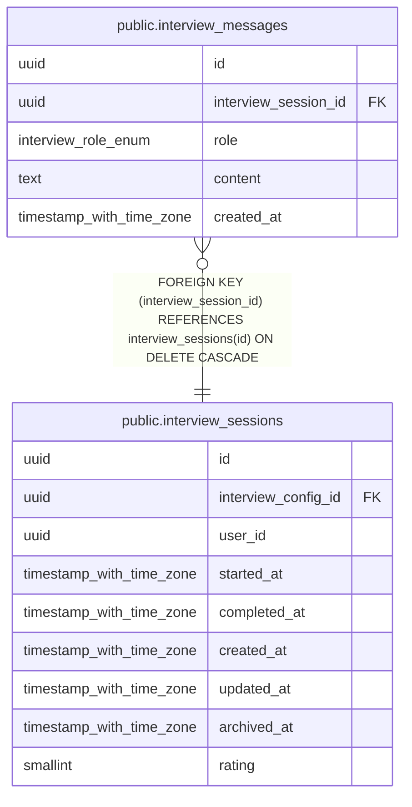

# public.interview_messages

## Description

インタビュー内の質問と回答を保存するテーブル

## Columns

| Name | Type | Default | Nullable | Children | Parents | Comment |
| ---- | ---- | ------- | -------- | -------- | ------- | ------- |
| id | uuid | gen_random_uuid() | false |  |  |  |
| interview_session_id | uuid |  | false |  | [public.interview_sessions](public.interview_sessions.md) | インタビューセッションID |
| role | interview_role_enum |  | false |  |  | メッセージの役割（assistant: AIからの質問, user: ユーザーからの回答） |
| content | text |  | false |  |  | メッセージ内容 |
| created_at | timestamp with time zone | now() | false |  |  | 作成日時 |

## Constraints

| Name | Type | Definition |
| ---- | ---- | ---------- |
| interview_messages_pkey | PRIMARY KEY | PRIMARY KEY (id) |
| interview_messages_interview_session_id_fkey | FOREIGN KEY | FOREIGN KEY (interview_session_id) REFERENCES interview_sessions(id) ON DELETE CASCADE |

## Indexes

| Name | Definition |
| ---- | ---------- |
| interview_messages_pkey | CREATE UNIQUE INDEX interview_messages_pkey ON public.interview_messages USING btree (id) |
| idx_interview_messages_session_created | CREATE INDEX idx_interview_messages_session_created ON public.interview_messages USING btree (interview_session_id, created_at) |
| idx_interview_messages_session_id | CREATE INDEX idx_interview_messages_session_id ON public.interview_messages USING btree (interview_session_id) |

## Relations

---

> Generated by [tbls](https://github.com/k1LoW/tbls)
