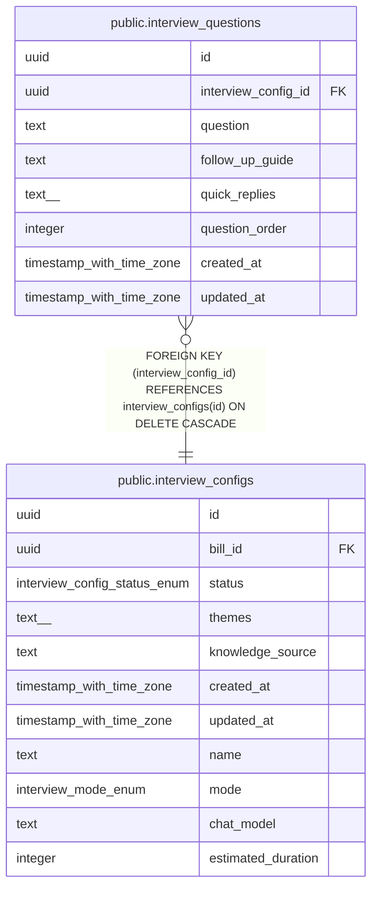

# public.interview_questions

## Description

事前定義されたインタビュー質問を管理するテーブル

## Columns

| Name | Type | Default | Nullable | Children | Parents | Comment |
| ---- | ---- | ------- | -------- | -------- | ------- | ------- |
| id | uuid | gen_random_uuid() | false |  |  |  |
| interview_config_id | uuid |  | false |  | [public.interview_configs](public.interview_configs.md) | インタビュー設定ID |
| question | text |  | false |  |  | 質問文 |
| follow_up_guide | text |  | true |  |  | 回答後のフォローアップ指針（深掘り方法など） |
| quick_replies | text[] |  | true |  |  | ユーザーが選択できるクイックリプライ |
| question_order | integer |  | false |  |  | 質問の順序 |
| created_at | timestamp with time zone | now() | false |  |  | 作成日時 |
| updated_at | timestamp with time zone | now() | false |  |  | 更新日時 |

## Constraints

| Name | Type | Definition |
| ---- | ---- | ---------- |
| interview_questions_interview_config_id_fkey | FOREIGN KEY | FOREIGN KEY (interview_config_id) REFERENCES interview_configs(id) ON DELETE CASCADE |
| interview_questions_pkey | PRIMARY KEY | PRIMARY KEY (id) |

## Indexes

| Name | Definition |
| ---- | ---------- |
| interview_questions_pkey | CREATE UNIQUE INDEX interview_questions_pkey ON public.interview_questions USING btree (id) |
| idx_interview_questions_config_id | CREATE INDEX idx_interview_questions_config_id ON public.interview_questions USING btree (interview_config_id) |
| idx_interview_questions_config_order | CREATE INDEX idx_interview_questions_config_order ON public.interview_questions USING btree (interview_config_id, question_order) |

## Triggers

| Name | Definition |
| ---- | ---------- |
| update_interview_questions_updated_at | CREATE TRIGGER update_interview_questions_updated_at BEFORE UPDATE ON public.interview_questions FOR EACH ROW EXECUTE FUNCTION update_updated_at_column() |

## Relations

---

> Generated by [tbls](https://github.com/k1LoW/tbls)
