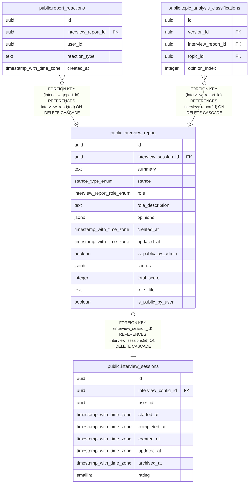

# public.interview_report

## Description

インタビュー結果のレポートを保存するテーブル（AIが自動生成）

## Columns

| Name | Type | Default | Nullable | Extra Definition | Children | Parents | Comment |
| ---- | ---- | ------- | -------- | ---------------- | -------- | ------- | ------- |
| id | uuid | gen_random_uuid() | false |  | [public.report_reactions](public.report_reactions.md) [public.topic_analysis_classifications](public.topic_analysis_classifications.md) |  |  |
| interview_session_id | uuid |  | false |  |  | [public.interview_sessions](public.interview_sessions.md) | インタビューセッションID（1セッション1レポート） |
| summary | text |  | true |  |  |  | インタビュー要約 |
| stance | stance_type_enum |  | true |  |  |  | AIが分析したユーザーのスタンス |
| role | interview_report_role_enum |  | true |  |  |  | AIが推論したユーザーの役割・属性（ENUM型） |
| role_description | text |  | true |  |  |  | 役割の説明 |
| opinions | jsonb |  | true |  |  |  | 意見の配列 [{title: string, content: string}, ...] |
| created_at | timestamp with time zone | now() | false |  |  |  | 作成日時 |
| updated_at | timestamp with time zone | now() | false |  |  |  | 更新日時 |
| is_public_by_admin | boolean | false | false |  |  |  | 管理者によるレポートの公開状態（true: 公開, false: 非公開） |
| scores | jsonb |  | true |  |  |  | インタビューの評価スコア（total, clarity, specificity, impact, constructiveness, reasoning） |
| total_score | integer |  | true | GENERATED ALWAYS AS  CASE     WHEN ((scores IS NOT NULL) AND ((scores -\>\> 'total'::text) IS NOT NULL) AND ((scores -\>\> 'total'::text) ~ '^\d+$'::text)) THEN ((scores -\>\> 'total'::text))::integer     ELSE NULL::integer END STORED |  |  | 総合スコア（0-100）- scoresから自動生成されるGenerated Column |
| role_title | text |  | true |  |  |  | A short title (10 characters or less) summarizing the user role, e.g., "物流業者", "主婦" |
| is_public_by_user | boolean | false | false |  |  |  | Whether the user has consented to making their interview report public |

## Constraints

| Name | Type | Definition |
| ---- | ---- | ---------- |
| interview_report_interview_session_id_key | UNIQUE | UNIQUE (interview_session_id) |
| interview_report_pkey | PRIMARY KEY | PRIMARY KEY (id) |
| interview_report_interview_session_id_fkey | FOREIGN KEY | FOREIGN KEY (interview_session_id) REFERENCES interview_sessions(id) ON DELETE CASCADE |

## Indexes

| Name | Definition |
| ---- | ---------- |
| interview_report_interview_session_id_key | CREATE UNIQUE INDEX interview_report_interview_session_id_key ON public.interview_report USING btree (interview_session_id) |
| interview_report_pkey | CREATE UNIQUE INDEX interview_report_pkey ON public.interview_report USING btree (id) |
| idx_interview_report_is_public_by_admin | CREATE INDEX idx_interview_report_is_public_by_admin ON public.interview_report USING btree (is_public_by_admin) |
| idx_interview_report_total_score | CREATE INDEX idx_interview_report_total_score ON public.interview_report USING btree (total_score DESC NULLS LAST) |

## Triggers

| Name | Definition |
| ---- | ---------- |
| update_interview_report_updated_at | CREATE TRIGGER update_interview_report_updated_at BEFORE UPDATE ON public.interview_report FOR EACH ROW EXECUTE FUNCTION update_updated_at_column() |

## Relations

---

> Generated by [tbls](https://github.com/k1LoW/tbls)
