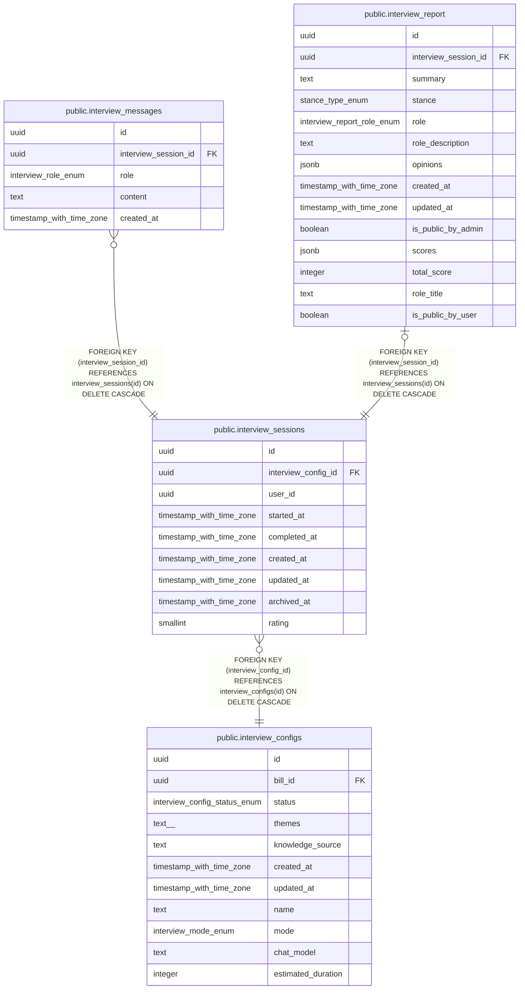

# public.interview_sessions

## Description

インタビューセッションを管理するテーブル

## Columns

| Name | Type | Default | Nullable | Children | Parents | Comment |
| ---- | ---- | ------- | -------- | -------- | ------- | ------- |
| id | uuid | gen_random_uuid() | false | [public.interview_messages](public.interview_messages.md) [public.interview_report](public.interview_report.md) |  |  |
| interview_config_id | uuid |  | false |  | [public.interview_configs](public.interview_configs.md) | インタビュー設定ID |
| user_id | uuid |  | false |  |  | ユーザーID（匿名認証） |
| started_at | timestamp with time zone | now() | false |  |  | 開始日時 |
| completed_at | timestamp with time zone |  | true |  |  | 完了日時 |
| created_at | timestamp with time zone | now() | false |  |  | 作成日時 |
| updated_at | timestamp with time zone | now() | false |  |  | 更新日時 |
| archived_at | timestamp with time zone |  | true |  |  | アーカイブ日時（やり直し時に設定） |
| rating | smallint |  | true |  |  | セッション評価(1-5) |

## Constraints

| Name | Type | Definition |
| ---- | ---- | ---------- |
| interview_sessions_rating_check | CHECK | CHECK (((rating >= 1) AND (rating <= 5))) |
| interview_sessions_interview_config_id_fkey | FOREIGN KEY | FOREIGN KEY (interview_config_id) REFERENCES interview_configs(id) ON DELETE CASCADE |
| interview_sessions_pkey | PRIMARY KEY | PRIMARY KEY (id) |

## Indexes

| Name | Definition |
| ---- | ---------- |
| interview_sessions_pkey | CREATE UNIQUE INDEX interview_sessions_pkey ON public.interview_sessions USING btree (id) |
| idx_interview_sessions_config_id | CREATE INDEX idx_interview_sessions_config_id ON public.interview_sessions USING btree (interview_config_id) |
| idx_interview_sessions_config_user | CREATE INDEX idx_interview_sessions_config_user ON public.interview_sessions USING btree (interview_config_id, user_id) |
| idx_interview_sessions_started_at | CREATE INDEX idx_interview_sessions_started_at ON public.interview_sessions USING btree (started_at) |
| idx_interview_sessions_user_id | CREATE INDEX idx_interview_sessions_user_id ON public.interview_sessions USING btree (user_id) |

## Triggers

| Name | Definition |
| ---- | ---------- |
| update_interview_sessions_updated_at | CREATE TRIGGER update_interview_sessions_updated_at BEFORE UPDATE ON public.interview_sessions FOR EACH ROW EXECUTE FUNCTION update_updated_at_column() |

## Relations

---

> Generated by [tbls](https://github.com/k1LoW/tbls)
