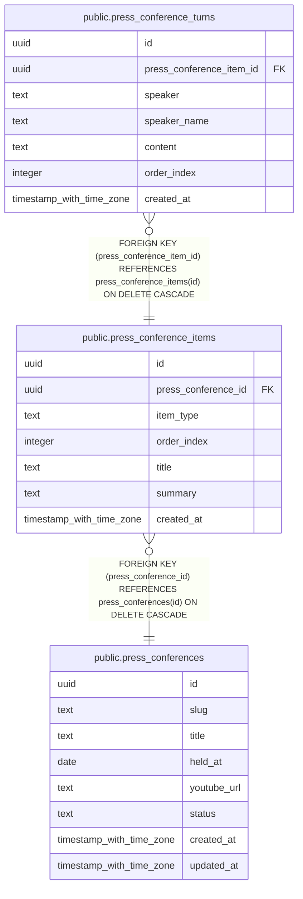

# public.press_conference_items

## Description

記者会見項目

## Columns

| Name | Type | Default | Nullable | Children | Parents | Comment |
| ---- | ---- | ------- | -------- | -------- | ------- | ------- |
| id | uuid | gen_random_uuid() | false | [public.press_conference_turns](public.press_conference_turns.md) |  |  |
| press_conference_id | uuid |  | false |  | [public.press_conferences](public.press_conferences.md) | 記者会見ID |
| item_type | text |  | false |  |  | 項目種別(announcement:発表 / qa:質疑応答) |
| order_index | integer |  | false |  |  | 表示順 |
| title | text |  | false |  |  | 項目タイトル |
| summary | text |  | true |  |  | 要約 |
| created_at | timestamp with time zone | now() | true |  |  |  |

## Constraints

| Name | Type | Definition |
| ---- | ---- | ---------- |
| press_conference_items_item_type_check | CHECK | CHECK ((item_type = ANY (ARRAY['announcement'::text, 'qa'::text]))) |
| press_conference_items_pkey | PRIMARY KEY | PRIMARY KEY (id) |
| press_conference_items_press_conference_id_fkey | FOREIGN KEY | FOREIGN KEY (press_conference_id) REFERENCES press_conferences(id) ON DELETE CASCADE |

## Indexes

| Name | Definition |
| ---- | ---------- |
| press_conference_items_pkey | CREATE UNIQUE INDEX press_conference_items_pkey ON public.press_conference_items USING btree (id) |
| press_conference_items_press_conference_id_order_index_idx | CREATE INDEX press_conference_items_press_conference_id_order_index_idx ON public.press_conference_items USING btree (press_conference_id, order_index) |

## Relations

---

> Generated by [tbls](https://github.com/k1LoW/tbls)
