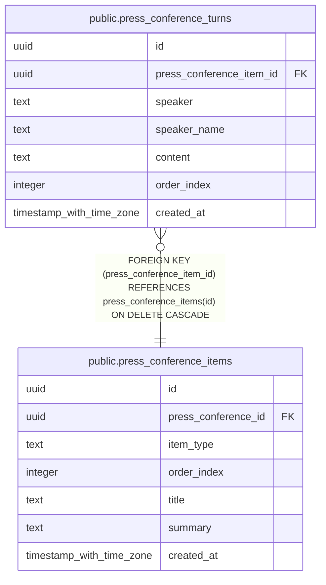

# public.press_conference_turns

## Description

記者会見の発言ターン

## Columns

| Name | Type | Default | Nullable | Children | Parents | Comment |
| ---- | ---- | ------- | -------- | -------- | ------- | ------- |
| id | uuid | gen_random_uuid() | false |  |  |  |
| press_conference_item_id | uuid |  | false |  | [public.press_conference_items](public.press_conference_items.md) | 記者会見項目ID |
| speaker | text |  | false |  |  | 発話者(mayor:市長 / reporter:記者) |
| speaker_name | text |  | true |  |  | 発話者名 |
| content | text |  | false |  |  | 発言内容 |
| order_index | integer |  | false |  |  | 表示順 |
| created_at | timestamp with time zone | now() | true |  |  |  |

## Constraints

| Name | Type | Definition |
| ---- | ---- | ---------- |
| press_conference_turns_speaker_check | CHECK | CHECK ((speaker = ANY (ARRAY['mayor'::text, 'reporter'::text]))) |
| press_conference_turns_press_conference_item_id_fkey | FOREIGN KEY | FOREIGN KEY (press_conference_item_id) REFERENCES press_conference_items(id) ON DELETE CASCADE |
| press_conference_turns_pkey | PRIMARY KEY | PRIMARY KEY (id) |

## Indexes

| Name | Definition |
| ---- | ---------- |
| press_conference_turns_pkey | CREATE UNIQUE INDEX press_conference_turns_pkey ON public.press_conference_turns USING btree (id) |
| press_conference_turns_press_conference_item_id_order_index_idx | CREATE INDEX press_conference_turns_press_conference_item_id_order_index_idx ON public.press_conference_turns USING btree (press_conference_item_id, order_index) |

## Relations

---

> Generated by [tbls](https://github.com/k1LoW/tbls)
