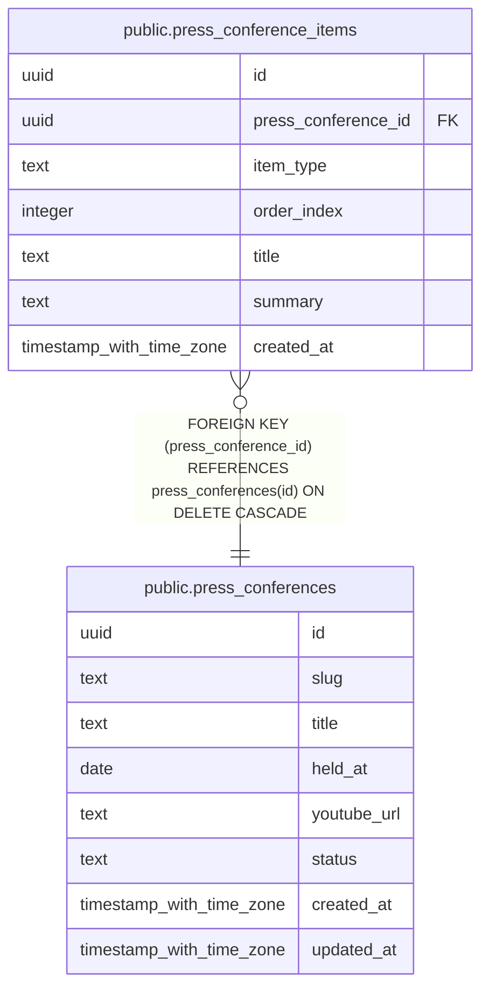

# public.press_conferences

## Description

記者会見

## Columns

| Name | Type | Default | Nullable | Children | Parents | Comment |
| ---- | ---- | ------- | -------- | -------- | ------- | ------- |
| id | uuid | gen_random_uuid() | false | [public.press_conference_items](public.press_conference_items.md) |  |  |
| slug | text |  | false |  |  | URL用スラッグ |
| title | text |  | false |  |  | 会見タイトル |
| held_at | date |  | false |  |  | 開催日 |
| youtube_url | text |  | true |  |  | YouTube動画URL |
| status | text | 'draft'::text | false |  |  | ステータス(draft/structuring/review/published/error) |
| created_at | timestamp with time zone | now() | true |  |  |  |
| updated_at | timestamp with time zone | now() | true |  |  |  |

## Constraints

| Name | Type | Definition |
| ---- | ---- | ---------- |
| press_conferences_status_check | CHECK | CHECK ((status = ANY (ARRAY['draft'::text, 'structuring'::text, 'review'::text, 'published'::text, 'error'::text]))) |
| press_conferences_pkey | PRIMARY KEY | PRIMARY KEY (id) |
| press_conferences_slug_key | UNIQUE | UNIQUE (slug) |

## Indexes

| Name | Definition |
| ---- | ---------- |
| press_conferences_pkey | CREATE UNIQUE INDEX press_conferences_pkey ON public.press_conferences USING btree (id) |
| press_conferences_slug_key | CREATE UNIQUE INDEX press_conferences_slug_key ON public.press_conferences USING btree (slug) |
| press_conferences_held_at_idx | CREATE INDEX press_conferences_held_at_idx ON public.press_conferences USING btree (held_at DESC) |
| press_conferences_slug_idx | CREATE INDEX press_conferences_slug_idx ON public.press_conferences USING btree (slug) |
| press_conferences_status_idx | CREATE INDEX press_conferences_status_idx ON public.press_conferences USING btree (status) |

## Relations

---

> Generated by [tbls](https://github.com/k1LoW/tbls)
