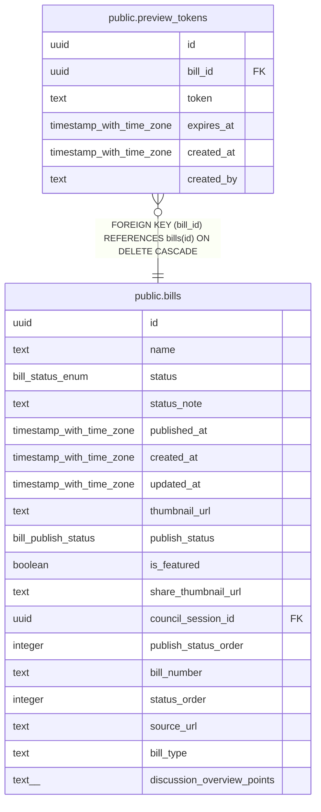

# public.preview_tokens

## Description

Preview tokens for bill access management

## Columns

| Name | Type | Default | Nullable | Children | Parents | Comment |
| ---- | ---- | ------- | -------- | -------- | ------- | ------- |
| id | uuid | uuid_generate_v4() | false |  |  | ID |
| bill_id | uuid |  | false |  | [public.bills](public.bills.md) | 議案ID |
| token | text |  | false |  |  | Unique preview access token |
| expires_at | timestamp with time zone |  | false |  |  | Token expiration date (30 days) |
| created_at | timestamp with time zone | now() | false |  |  | 作成日時 |
| created_by | text |  | true |  |  | 作成者 |

## Constraints

| Name | Type | Definition |
| ---- | ---- | ---------- |
| preview_tokens_bill_id_fkey | FOREIGN KEY | FOREIGN KEY (bill_id) REFERENCES bills(id) ON DELETE CASCADE |
| preview_tokens_pkey | PRIMARY KEY | PRIMARY KEY (id) |
| preview_tokens_token_key | UNIQUE | UNIQUE (token) |

## Indexes

| Name | Definition |
| ---- | ---------- |
| preview_tokens_pkey | CREATE UNIQUE INDEX preview_tokens_pkey ON public.preview_tokens USING btree (id) |
| preview_tokens_token_key | CREATE UNIQUE INDEX preview_tokens_token_key ON public.preview_tokens USING btree (token) |
| idx_preview_tokens_bill_id | CREATE INDEX idx_preview_tokens_bill_id ON public.preview_tokens USING btree (bill_id) |
| idx_preview_tokens_expires_at | CREATE INDEX idx_preview_tokens_expires_at ON public.preview_tokens USING btree (expires_at) |
| idx_preview_tokens_token | CREATE INDEX idx_preview_tokens_token ON public.preview_tokens USING btree (token) |

## Relations

---

> Generated by [tbls](https://github.com/k1LoW/tbls)
