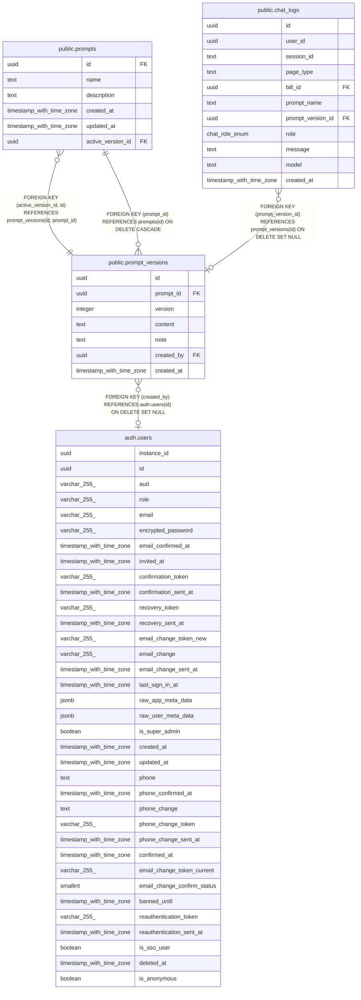

# public.prompt_versions

## Description

プロンプトの版（追記のみ）

## Columns

| Name | Type | Default | Nullable | Children | Parents | Comment |
| ---- | ---- | ------- | -------- | -------- | ------- | ------- |
| id | uuid | gen_random_uuid() | false | [public.prompts](public.prompts.md) [public.chat_logs](public.chat_logs.md) |  |  |
| prompt_id | uuid |  | false | [public.prompts](public.prompts.md) | [public.prompts](public.prompts.md) |  |
| version | integer |  | false |  |  | 版番号（プロンプトごとに1から連番） |
| content | text |  | false |  |  | 本文。{{変数名}} は呼び出し時に埋め込まれる |
| note | text |  | true |  |  | 変更メモ |
| created_by | uuid |  | true |  | [auth.users](auth.users.md) | 作成した管理者 |
| created_at | timestamp with time zone | now() | false |  |  |  |

## Constraints

| Name | Type | Definition |
| ---- | ---- | ---------- |
| prompt_versions_version_check | CHECK | CHECK ((version > 0)) |
| prompt_versions_created_by_fkey | FOREIGN KEY | FOREIGN KEY (created_by) REFERENCES auth.users(id) ON DELETE SET NULL |
| prompt_versions_prompt_id_fkey | FOREIGN KEY | FOREIGN KEY (prompt_id) REFERENCES prompts(id) ON DELETE CASCADE |
| prompt_versions_pkey | PRIMARY KEY | PRIMARY KEY (id) |
| prompt_versions_prompt_id_version_key | UNIQUE | UNIQUE (prompt_id, version) |
| prompt_versions_id_prompt_id_key | UNIQUE | UNIQUE (id, prompt_id) |

## Indexes

| Name | Definition |
| ---- | ---------- |
| prompt_versions_pkey | CREATE UNIQUE INDEX prompt_versions_pkey ON public.prompt_versions USING btree (id) |
| prompt_versions_prompt_id_version_key | CREATE UNIQUE INDEX prompt_versions_prompt_id_version_key ON public.prompt_versions USING btree (prompt_id, version) |
| prompt_versions_id_prompt_id_key | CREATE UNIQUE INDEX prompt_versions_id_prompt_id_key ON public.prompt_versions USING btree (id, prompt_id) |

## Relations

---

> Generated by [tbls](https://github.com/k1LoW/tbls)
