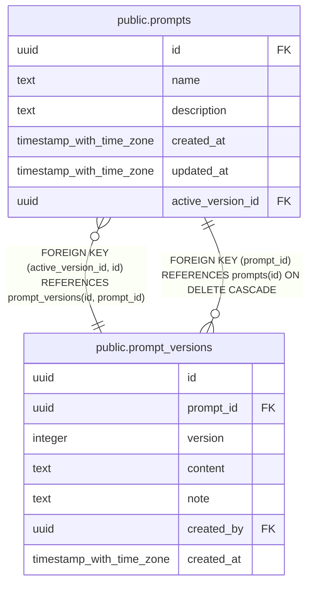

# public.prompts

## Description

AIチャットのシステムプロンプト

## Columns

| Name | Type | Default | Nullable | Children | Parents | Comment |
| ---- | ---- | ------- | -------- | -------- | ------- | ------- |
| id | uuid | gen_random_uuid() | false | [public.prompt_versions](public.prompt_versions.md) | [public.prompt_versions](public.prompt_versions.md) |  |
| name | text |  | false |  |  | プロンプト名（コードから参照するキー。例: bill-chat-system-normal） |
| description | text |  | true |  |  | 用途の説明 |
| created_at | timestamp with time zone | now() | false |  |  |  |
| updated_at | timestamp with time zone | now() | false |  |  |  |
| active_version_id | uuid |  | true |  | [public.prompt_versions](public.prompt_versions.md) | 本番で使う版 |

## Constraints

| Name | Type | Definition |
| ---- | ---- | ---------- |
| prompts_pkey | PRIMARY KEY | PRIMARY KEY (id) |
| prompts_name_key | UNIQUE | UNIQUE (name) |
| prompts_active_version_fkey | FOREIGN KEY | FOREIGN KEY (active_version_id, id) REFERENCES prompt_versions(id, prompt_id) |

## Indexes

| Name | Definition |
| ---- | ---------- |
| prompts_pkey | CREATE UNIQUE INDEX prompts_pkey ON public.prompts USING btree (id) |
| prompts_name_key | CREATE UNIQUE INDEX prompts_name_key ON public.prompts USING btree (name) |

## Triggers

| Name | Definition |
| ---- | ---------- |
| update_prompts_updated_at | CREATE TRIGGER update_prompts_updated_at BEFORE UPDATE ON public.prompts FOR EACH ROW EXECUTE FUNCTION update_updated_at_column() |

## Relations

---

> Generated by [tbls](https://github.com/k1LoW/tbls)
