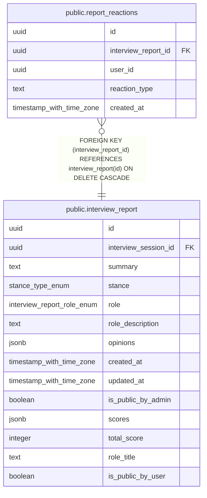

# public.report_reactions

## Description

レポートへのリアクション

## Columns

| Name | Type | Default | Nullable | Children | Parents | Comment |
| ---- | ---- | ------- | -------- | -------- | ------- | ------- |
| id | uuid | gen_random_uuid() | false |  |  |  |
| interview_report_id | uuid |  | false |  | [public.interview_report](public.interview_report.md) | インタビューレポートID |
| user_id | uuid |  | false |  |  | ユーザーID |
| reaction_type | text |  | false |  |  | リアクション種別(helpful or hmm) |
| created_at | timestamp with time zone | now() | false |  |  |  |

## Constraints

| Name | Type | Definition |
| ---- | ---- | ---------- |
| report_reactions_reaction_type_check | CHECK | CHECK ((reaction_type = ANY (ARRAY['helpful'::text, 'hmm'::text]))) |
| report_reactions_interview_report_id_fkey | FOREIGN KEY | FOREIGN KEY (interview_report_id) REFERENCES interview_report(id) ON DELETE CASCADE |
| report_reactions_interview_report_id_user_id_key | UNIQUE | UNIQUE (interview_report_id, user_id) |
| report_reactions_pkey | PRIMARY KEY | PRIMARY KEY (id) |

## Indexes

| Name | Definition |
| ---- | ---------- |
| report_reactions_interview_report_id_user_id_key | CREATE UNIQUE INDEX report_reactions_interview_report_id_user_id_key ON public.report_reactions USING btree (interview_report_id, user_id) |
| report_reactions_pkey | CREATE UNIQUE INDEX report_reactions_pkey ON public.report_reactions USING btree (id) |
| idx_report_reactions_report_id | CREATE INDEX idx_report_reactions_report_id ON public.report_reactions USING btree (interview_report_id) |
| idx_report_reactions_user_id | CREATE INDEX idx_report_reactions_user_id ON public.report_reactions USING btree (user_id) |

## Relations

---

> Generated by [tbls](https://github.com/k1LoW/tbls)
