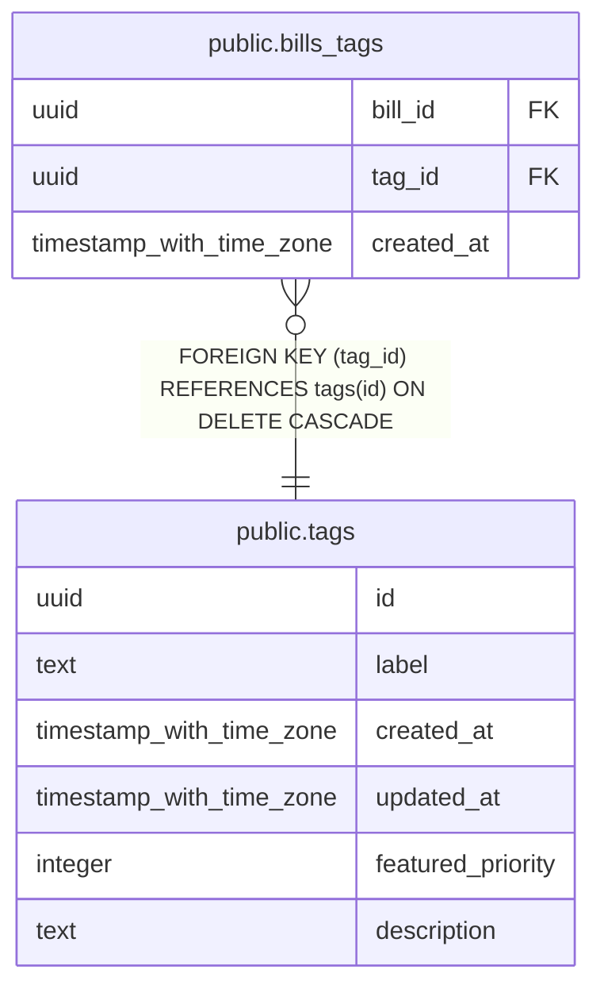

# public.tags

## Description

Master table for tags

## Columns

| Name | Type | Default | Nullable | Children | Parents | Comment |
| ---- | ---- | ------- | -------- | -------- | ------- | ------- |
| id | uuid | gen_random_uuid() | false | [public.bills_tags](public.bills_tags.md) |  | ID |
| label | text |  | false |  |  | Tag label (display name) |
| created_at | timestamp with time zone | now() | false |  |  | 作成日時 |
| updated_at | timestamp with time zone | now() | false |  |  | 更新日時 |
| featured_priority | integer |  | true |  |  | Featured表示の優先度（数値が小さいほど優先度が高い）。NULLの場合は非表示 |
| description | text |  | true |  |  | タグ説明文 |

## Constraints

| Name | Type | Definition |
| ---- | ---- | ---------- |
| tags_label_key | UNIQUE | UNIQUE (label) |
| tags_pkey | PRIMARY KEY | PRIMARY KEY (id) |

## Indexes

| Name | Definition |
| ---- | ---------- |
| tags_label_key | CREATE UNIQUE INDEX tags_label_key ON public.tags USING btree (label) |
| tags_pkey | CREATE UNIQUE INDEX tags_pkey ON public.tags USING btree (id) |
| idx_tags_featured_priority | CREATE INDEX idx_tags_featured_priority ON public.tags USING btree (featured_priority) WHERE (featured_priority IS NOT NULL) |

## Triggers

| Name | Definition |
| ---- | ---------- |
| update_tags_updated_at | CREATE TRIGGER update_tags_updated_at BEFORE UPDATE ON public.tags FOR EACH ROW EXECUTE FUNCTION update_updated_at_column() |

## Relations

---

> Generated by [tbls](https://github.com/k1LoW/tbls)
