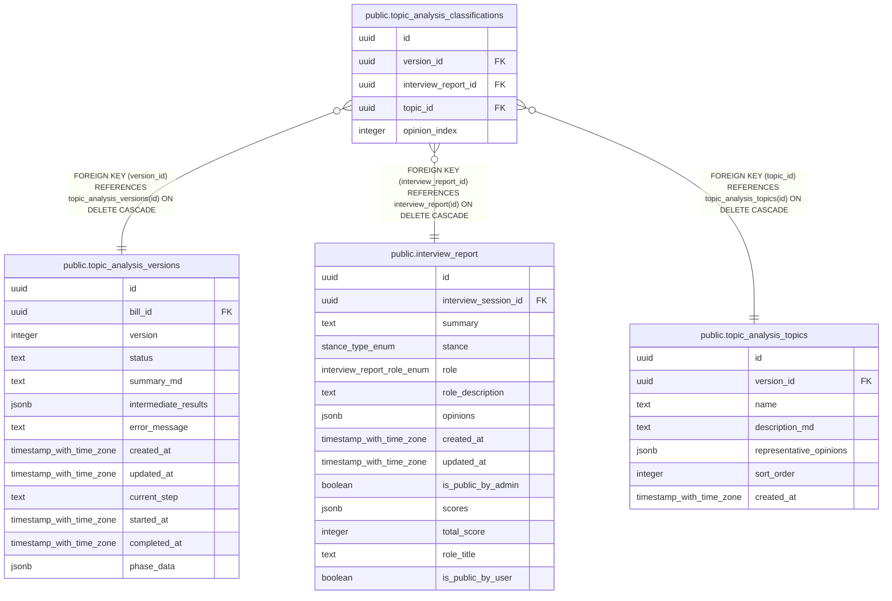

# public.topic_analysis_classifications

## Description

意見とトピックの分類（多対多）

## Columns

| Name | Type | Default | Nullable | Children | Parents | Comment |
| ---- | ---- | ------- | -------- | -------- | ------- | ------- |
| id | uuid | gen_random_uuid() | false |  |  |  |
| version_id | uuid |  | false |  | [public.topic_analysis_versions](public.topic_analysis_versions.md) | 所属バージョンID |
| interview_report_id | uuid |  | false |  | [public.interview_report](public.interview_report.md) | インタビューレポートID |
| topic_id | uuid |  | false |  | [public.topic_analysis_topics](public.topic_analysis_topics.md) | トピックID |
| opinion_index | integer |  | false |  |  | レポート内の意見インデックス |

## Constraints

| Name | Type | Definition |
| ---- | ---- | ---------- |
| topic_analysis_classifications_interview_report_id_fkey | FOREIGN KEY | FOREIGN KEY (interview_report_id) REFERENCES interview_report(id) ON DELETE CASCADE |
| topic_analysis_classification_version_id_interview_report_i_key | UNIQUE | UNIQUE (version_id, interview_report_id, topic_id, opinion_index) |
| topic_analysis_classifications_pkey | PRIMARY KEY | PRIMARY KEY (id) |
| topic_analysis_classifications_topic_id_fkey | FOREIGN KEY | FOREIGN KEY (topic_id) REFERENCES topic_analysis_topics(id) ON DELETE CASCADE |
| topic_analysis_classifications_version_id_fkey | FOREIGN KEY | FOREIGN KEY (version_id) REFERENCES topic_analysis_versions(id) ON DELETE CASCADE |

## Indexes

| Name | Definition |
| ---- | ---------- |
| topic_analysis_classification_version_id_interview_report_i_key | CREATE UNIQUE INDEX topic_analysis_classification_version_id_interview_report_i_key ON public.topic_analysis_classifications USING btree (version_id, interview_report_id, topic_id, opinion_index) |
| topic_analysis_classifications_pkey | CREATE UNIQUE INDEX topic_analysis_classifications_pkey ON public.topic_analysis_classifications USING btree (id) |
| idx_topic_analysis_classifications_topic_id | CREATE INDEX idx_topic_analysis_classifications_topic_id ON public.topic_analysis_classifications USING btree (topic_id) |
| idx_topic_analysis_classifications_version_id | CREATE INDEX idx_topic_analysis_classifications_version_id ON public.topic_analysis_classifications USING btree (version_id) |

## Relations

---

> Generated by [tbls](https://github.com/k1LoW/tbls)
