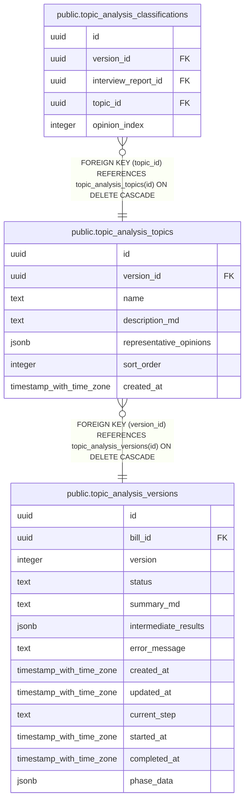

# public.topic_analysis_topics

## Description

トピック解析で抽出されたトピック

## Columns

| Name | Type | Default | Nullable | Children | Parents | Comment |
| ---- | ---- | ------- | -------- | -------- | ------- | ------- |
| id | uuid | gen_random_uuid() | false | [public.topic_analysis_classifications](public.topic_analysis_classifications.md) |  |  |
| version_id | uuid |  | false |  | [public.topic_analysis_versions](public.topic_analysis_versions.md) | 所属バージョンID |
| name | text |  | false |  |  | トピック名 |
| description_md | text |  | false |  |  | トピックの説明文（markdown形式） |
| representative_opinions | jsonb | '[]'::jsonb | false |  |  | 代表的な意見（JSON配列、最大5件） |
| sort_order | integer | 0 | false |  |  | 表示順 |
| created_at | timestamp with time zone | now() | false |  |  |  |

## Constraints

| Name | Type | Definition |
| ---- | ---- | ---------- |
| topic_analysis_topics_pkey | PRIMARY KEY | PRIMARY KEY (id) |
| topic_analysis_topics_version_id_fkey | FOREIGN KEY | FOREIGN KEY (version_id) REFERENCES topic_analysis_versions(id) ON DELETE CASCADE |

## Indexes

| Name | Definition |
| ---- | ---------- |
| topic_analysis_topics_pkey | CREATE UNIQUE INDEX topic_analysis_topics_pkey ON public.topic_analysis_topics USING btree (id) |
| idx_topic_analysis_topics_version_id | CREATE INDEX idx_topic_analysis_topics_version_id ON public.topic_analysis_topics USING btree (version_id) |

## Relations

---

> Generated by [tbls](https://github.com/k1LoW/tbls)
