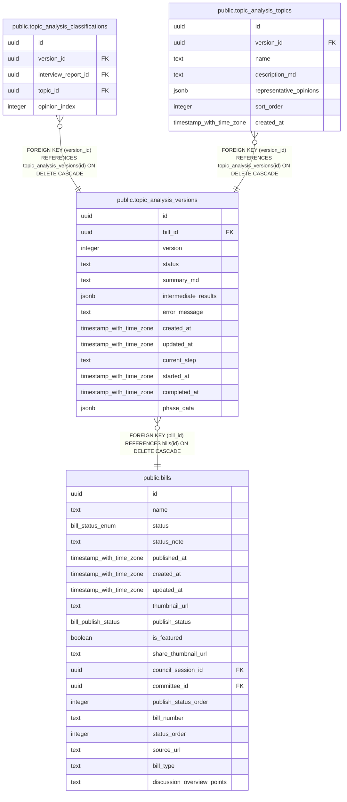

# public.topic_analysis_versions

## Description

トピック解析のバージョン管理

## Columns

| Name | Type | Default | Nullable | Children | Parents | Comment |
| ---- | ---- | ------- | -------- | -------- | ------- | ------- |
| id | uuid | gen_random_uuid() | false | [public.topic_analysis_classifications](public.topic_analysis_classifications.md) [public.topic_analysis_topics](public.topic_analysis_topics.md) |  |  |
| bill_id | uuid |  | false |  | [public.bills](public.bills.md) | 対象議案ID |
| version | integer |  | false |  |  | バージョン番号（議案ごとにインクリメント） |
| status | text | 'pending'::text | false |  |  | 解析ステータス: pending, running, completed, failed |
| summary_md | text |  | true |  |  | 全体サマリ（markdown形式） |
| intermediate_results | jsonb |  | true |  |  | 中間結果（デバッグ・参照用） |
| error_message | text |  | true |  |  | エラー時のメッセージ |
| created_at | timestamp with time zone | now() | false |  |  |  |
| updated_at | timestamp with time zone | now() | false |  |  |  |
| current_step | text |  | true |  |  | 現在のステップ |
| started_at | timestamp with time zone |  | true |  |  | 開始日時 |
| completed_at | timestamp with time zone |  | true |  |  | 完了日時 |
| phase_data | jsonb |  | true |  |  | フェーズ間データ受け渡し用 |

## Constraints

| Name | Type | Definition |
| ---- | ---- | ---------- |
| topic_analysis_versions_status_check | CHECK | CHECK ((status = ANY (ARRAY['pending'::text, 'running'::text, 'completed'::text, 'failed'::text]))) |
| topic_analysis_versions_bill_id_fkey | FOREIGN KEY | FOREIGN KEY (bill_id) REFERENCES bills(id) ON DELETE CASCADE |
| topic_analysis_versions_bill_id_version_key | UNIQUE | UNIQUE (bill_id, version) |
| topic_analysis_versions_pkey | PRIMARY KEY | PRIMARY KEY (id) |

## Indexes

| Name | Definition |
| ---- | ---------- |
| topic_analysis_versions_bill_id_version_key | CREATE UNIQUE INDEX topic_analysis_versions_bill_id_version_key ON public.topic_analysis_versions USING btree (bill_id, version) |
| topic_analysis_versions_pkey | CREATE UNIQUE INDEX topic_analysis_versions_pkey ON public.topic_analysis_versions USING btree (id) |
| idx_topic_analysis_versions_bill_id | CREATE INDEX idx_topic_analysis_versions_bill_id ON public.topic_analysis_versions USING btree (bill_id) |

## Triggers

| Name | Definition |
| ---- | ---------- |
| set_topic_analysis_versions_updated_at | CREATE TRIGGER set_topic_analysis_versions_updated_at BEFORE UPDATE ON public.topic_analysis_versions FOR EACH ROW EXECUTE FUNCTION update_updated_at_column() |

## Relations

---

> Generated by [tbls](https://github.com/k1LoW/tbls)
